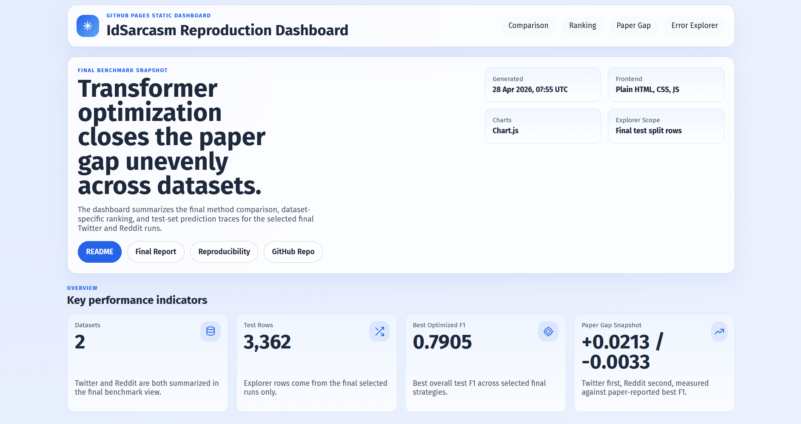

# IdSarcasm Reproduction and Transformer Optimization

[](https://github.com/feb027/idsarcasm-reproduction/actions/workflows/validate.yml)
[](https://feb027.github.io/idsarcasm-reproduction/)
[](docs/laporan-proyek.md)
[](#verification)
[](requirements.txt)

Repository ini berisi reproduksi dan optimasi paper **“IdSarcasm: Benchmarking and Evaluating Language Models for Indonesian Sarcasm Detection”** (Suhartono, Wongso, Handoyo — IEEE Access 2024).

**Judul proyek:** Optimasi Performa Model Transformer dalam Klasifikasi Sarkasme Teks Berbahasa Indonesia Berdasarkan Benchmark IdSarcasm

## Quick Links

| Halaman | Link |
|---|---|
| Dashboard interaktif | <https://feb027.github.io/idsarcasm-reproduction/> |
| Laporan akhir | [`docs/laporan-proyek.md`](docs/laporan-proyek.md) |
| Reproducibility guide | [`docs/reproducibility.md`](docs/reproducibility.md) |
| Model card | [`docs/model-card.md`](docs/model-card.md) |
| Error analysis | [`docs/error-analysis.md`](docs/error-analysis.md) |
| Paper DOI | [10.1109/ACCESS.2024.3416955](https://doi.org/10.1109/ACCESS.2024.3416955) |
| Original repository | <https://github.com/w11wo/id_sarcasm> |

## Project Snapshot

| Dataset | Metode terbaik | Baseline F1 | Final F1 | Paper F1 | Status |
|---|---|---:|---:|---:|---|
| Twitter | XLM-R Large + LR `2e-5` | 0.7226 | **0.7905** | 0.7692 | **+0.0213 above paper** |
| Reddit | XLM-R Large + threshold tuning | 0.6117 | **0.6241** | 0.6274 | **-0.0033 near paper** |

Temuan utama:

- XLM-R Large menjadi model terbaik untuk kedua dataset.
- Optimasi learning rate pada Twitter berhasil melampaui paper: `0.7905` vs `0.7692`.
- Reddit membaik lewat threshold tuning: `0.6117` → `0.6241`, tetapi masih sedikit di bawah paper `0.6274`.
- Classical ML tetap kompetitif pada Twitter, terutama BoW Logistic Regression (`F1 = 0.7206`).
- Zero-shot BLOOMZ/mT0 dan local LLM modern belum mendekati fine-tuned transformer.

## Dashboard Preview

Dashboard statis GitHub Pages membaca artefak hasil final yang sudah dikomit. Tidak ada backend, build step, atau training ulang.

[](https://feb027.github.io/idsarcasm-reproduction/)

Fitur dashboard:

- KPI final Twitter dan Reddit.
- Chart perbandingan metode dan ranking per dataset.
- Paper-gap cards agar jelas dataset mana yang melampaui paper.
- Error explorer untuk melihat contoh prediksi benar/salah pada split test.
- Filter dataset, outcome, strategy, label, dan search text.


## Final Error Analysis


| Dataset | TN | FP | FN | TP | Reading |
|---|---:|---:|---:|---:|---|
| Twitter | 359 | 45 | 17 | 117 | Strong recall on sarcastic class; final F1 `0.7905`. |
| Reddit | 1,726 | 392 | 208 | 498 | Higher FP/FN pressure; final F1 `0.6241`. |

Detail examples and pattern notes are in [`docs/error-analysis.md`](docs/error-analysis.md).

## Repository Map

```text
├── .github/workflows/validate.yml     # Lightweight CI checks
├── CITATION.cff                       # Citation metadata for the repo
├── index.html                         # Entry point GitHub Pages dashboard
├── dashboard/
│   ├── app.js                         # Logic dashboard + error explorer
│   ├── styles.css                     # Styling dashboard statis
│   └── data/dashboard-data.json       # Data dashboard hasil generate
├── data/                              # Dataset lokal, tidak dikomit jika besar
├── docs/
│   ├── laporan-proyek.md              # Laporan akhir
│   ├── reproducibility.md             # Panduan menjalankan ulang eksperimen
│   ├── paper-summary.md               # Ringkasan paper
│   ├── model-card.md                  # Ringkasan model final, limitasi, intended use
│   ├── error-analysis.md              # Analisis FP/FN dan confusion matrix final
│   └── progress/                      # Catatan progress dan run guide
├── notebooks/
│   ├── 01_eda.ipynb
│   ├── 02_transformer_baseline_colab.ipynb
│   ├── 03_zeroshot_baseline_colab_or_lmstudio.ipynb
│   └── 04_progress5_optimization_and_modern_llm.ipynb
├── results/
│   ├── figures/                       # Figure untuk laporan dan README
│   ├── tables/                        # CSV ringkasan hasil utama
│   ├── transformer/                   # Output transformer baseline
│   ├── zeroshot/                      # Output zero-shot LLM
│   ├── optimization/                  # Output optimasi transformer
│   ├── modern_llm/                    # Output eksperimen local LLM
│   └── progress5_error_analysis/      # Analisis transisi error
├── scripts/
│   ├── run_classical_baselines.py
│   ├── run_transformer_baseline.py
│   ├── run_zeroshot_baseline.py
│   ├── run_transformer_optimization.py
│   ├── run_modern_llm_experiments.py
│   ├── generate_final_analysis.py
│   ├── generate_final_error_analysis.py
│   └── generate_dashboard_data.py
├── source-code/                       # Snapshot repo paper asli sebagai referensi
├── tests/                             # Unit tests runner dan utilitas
└── .nojekyll                          # GitHub Pages: disable Jekyll processing
```

## Dataset

| Dataset | Train | Validation | Test | Total | Rasio label |
|---|---:|---:|---:|---:|---|
| Reddit Indonesia Sarcastic | 9,881 | 1,411 | 2,824 | 14,116 | 25% sarcastic / 75% non-sarcastic |
| Twitter Indonesia Sarcastic | 1,878 | 268 | 538 | 2,684 | 25% sarcastic / 75% non-sarcastic |

Dataset berasal dari koleksi HuggingFace IdSarcasm. Proporsi kelas konsisten pada train, validation, dan test.

## Experiment Matrix

| Tahap | Isi | Output utama | Status |
|---|---|---|---|
| Classical ML | Logistic Regression, Naive Bayes, SVM + BoW/TF-IDF | `results/tables/classical_baselines_*.csv` | selesai |
| Transformer baseline | IndoBERT, mBERT, XLM-R | `results/tables/transformer_baselines.csv` | selesai |
| Zero-shot LLM | BLOOMZ dan mT0 sesuai paper | `results/tables/zeroshot_baselines.csv` | Twitter 9/9, Reddit 5/9 selesai |
| Optimasi transformer | Threshold tuning + LR screening | `results/tables/optimization_runs.csv` | selesai |
| Modern local LLM | Qwen3.5-4B dan Gemma 4 E4B via LM Studio | `results/tables/modern_llm_experiments.csv` | Twitter selesai |
| Final analysis | Perbandingan akhir + figure final | `results/tables/final_*.csv`, `results/figures/final_*.png` | selesai |
| Static dashboard | GitHub Pages + error explorer | `dashboard/data/dashboard-data.json` | live |

## Run Locally

<details>
<summary><strong>1. Setup environment</strong></summary>

```bash
git clone https://github.com/feb027/idsarcasm-reproduction.git
cd idsarcasm-reproduction
python -m venv .venv
source .venv/bin/activate      # Linux/WSL
# .venv\Scripts\activate      # Windows PowerShell
pip install -r requirements.txt
python scripts/download_data.py
```

</details>

<details>
<summary><strong>2. Regenerate final tables, figures, and dashboard data</strong></summary>

```bash
python scripts/generate_progress5_analysis.py
python scripts/generate_final_analysis.py
python scripts/generate_dashboard_data.py
python scripts/generate_final_error_analysis.py
```

Output utama:

```text
results/tables/progress5_*.csv
results/tables/final_*.csv
results/figures/progress5_*.png
results/figures/final_*.png
dashboard/data/dashboard-data.json
results/tables/final_confusion_matrices.csv
results/tables/final_error_examples.csv
results/figures/final_confusion_matrices.png
```

</details>

<details>
<summary><strong>3. Preview dashboard locally</strong></summary>

```bash
python -m http.server 8027
```

Buka:

```text
http://127.0.0.1:8027/
```

Catatan: gunakan local server, bukan `file://`, karena dashboard membaca JSON dengan `fetch()`.

</details>

<details>
<summary><strong>4. Run tests</strong></summary>

```bash
python -m pytest tests/ -q
```

</details>

## Verification

Status terakhir:

```text
30 tests passed
py_compile OK
node --check dashboard/app.js OK
missing_images []
figs_ok True
tables_ok True
orphan_refs []
missing_refs []
dashboard_data_ok
notebooks_json_ok
GitHub Pages status: built
```

Final verification summary:

```text
SCORE: 96/100
STATUS: PASS
Critical fixes: None
```

## Key Artifacts

| Artefak | Path |
|---|---|
| Final comparison table | [`results/tables/final_method_comparison.csv`](results/tables/final_method_comparison.csv) |
| Final ranking table | [`results/tables/final_method_ranking.csv`](results/tables/final_method_ranking.csv) |
| Final comparison figure | [`results/figures/final_method_comparison.png`](results/figures/final_method_comparison.png) |
| Final progress summary | [`results/figures/final_progress_summary.png`](results/figures/final_progress_summary.png) |
| Twitter final predictions | [`results/optimization/twitter-xlmr-large-lr2e-5-len128/predictions.csv`](results/optimization/twitter-xlmr-large-lr2e-5-len128/predictions.csv) |
| Reddit final predictions | [`results/optimization/reddit-xlmr-large-threshold/predictions.csv`](results/optimization/reddit-xlmr-large-threshold/predictions.csv) |
| Dashboard data | [`dashboard/data/dashboard-data.json`](dashboard/data/dashboard-data.json) |
| Confusion matrix figure | [`results/figures/final_confusion_matrices.png`](results/figures/final_confusion_matrices.png) |
| Error examples | [`results/tables/final_error_examples.csv`](results/tables/final_error_examples.csv) |
| Model card | [`docs/model-card.md`](docs/model-card.md) |
| Error analysis doc | [`docs/error-analysis.md`](docs/error-analysis.md) |
| Citation metadata | [`CITATION.cff`](CITATION.cff) |
| Final report | [`docs/laporan-proyek.md`](docs/laporan-proyek.md) |
| Reproducibility guide | [`docs/reproducibility.md`](docs/reproducibility.md) |

## Notes

- Checkpoint model hasil fine-tuning tidak dikomit karena ukuran file besar.
- Artefak yang dikomit adalah script, notebook, tabel, figure, log penting, dan prediction CSV untuk analisis.
- Dashboard adalah visualisasi hasil, bukan eksperimen baru.
- Confusion matrix dan error analysis membaca prediction CSV final; tidak ada training tambahan.
- Reddit modern local LLM belum dijalankan karena inference akan jauh lebih lama dibanding Twitter.


## Cite This Reproduction

If this repository is reused, cite the repository metadata in [`CITATION.cff`](CITATION.cff) and cite the original IdSarcasm paper below.

## Citation

```bibtex
@article{10565877,
  author = {Suhartono, Derwin and Wongso, Wilson and Tri Handoyo, Alif},
  journal = {IEEE Access},
  title = {IdSarcasm: Benchmarking and Evaluating Language Models for Indonesian Sarcasm Detection},
  year = {2024},
  pages = {87323-87332},
  doi = {10.1109/ACCESS.2024.3416955}
}
```
