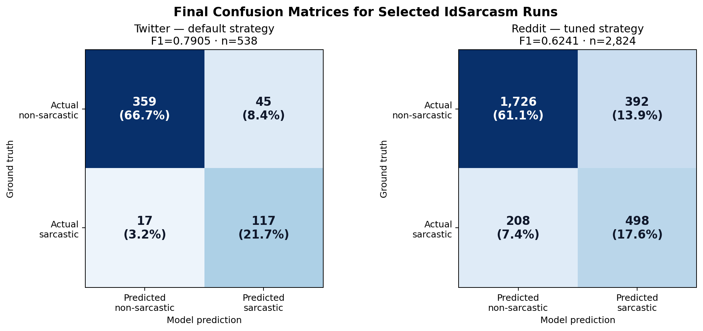

# Final Error Analysis

Dokumen ini merangkum error analysis ringan dari run final IdSarcasm. Analisis ini tidak menjalankan training baru; semua contoh diambil dari prediction CSV yang sudah dikomit.

## Selected Runs

| Dataset | Run | Strategy | Test rows | F1 | Precision | Recall |
|---|---|---|---:|---:|---:|---:|
| Twitter | XLM-R Large lr=2e-5 | default | 538 | 0.7905 | 0.7222 | 0.8731 |
| Reddit | XLM-R Large threshold tuning | tuned | 2824 | 0.6241 | 0.5596 | 0.7054 |


## Confusion Matrix



| Dataset | TN | FP | FN | TP | Main reading |
|---|---:|---:|---:|---:|---|
| Twitter | 359 | 45 | 17 | 117 | Twitter kuat karena FN rendah dan recall sarkasme tinggi. |
| Reddit | 1726 | 392 | 208 | 498 | Reddit lebih sulit; FP dan FN masih sama-sama besar. |


## Error Pattern Summary

### 1. False Positive: teks non-sarkastik diprediksi sarkastik

Pola yang sering muncul:

- Kalimat bernada kritik, sindiran sosial, atau ekspresi emosional.
- Ada kata seperti “halal/haram”, “rakyat jelata”, “monopoli”, atau ekspresi politis yang mirip gaya sarkasme.
- Model menangkap tone negatif/ironis, tetapi label aslinya non-sarkastik.

| Dataset | Error | P(sarcastic) | Text |
|---|---|---:|---|
| twitter | false_positive | 1.0000 | Orang Indonesia ini sopan-sopan banget ya .. Mau nyapres saja misi dulu . |
| twitter | false_positive | 1.0000 | Diskotik halal Main catur haram Nonton film korea haram . Ok . Selamat datang dinegaraku . |
| twitter | false_positive | 0.9999 | <username> Ini pengusaha apa pejabat atau pensiunan atau apa ya .. buanyak banget dapat dri mana itu ?? |
| reddit | false_positive | 0.9669 | ya kan perlu d ancem biar sukur2 dapet tax money... |
| reddit | false_positive | 0.9663 | Loh iya kan modal halodek udah dapat, bukan kaya kita rakyat jelata yang perjuangannya mesti bisa membangun 1000 candi dalam satu malam |
| reddit | false_positive | 0.9660 | alhamdulillah, Indonesia menuju monopoli/duopoli. |


### 2. False Negative: teks sarkastik diprediksi non-sarkastik

Pola yang sering muncul:

- Sarkasme sangat bergantung pada konteks sosial atau percakapan sebelumnya.
- Kalimat terlihat informatif secara permukaan, sehingga model tidak menangkap maksud kebalikannya.
- Beberapa contoh memakai bahasa campuran, slang, atau humor implisit.

| Dataset | Error | P(sarcastic) | Text |
|---|---|---:|---|
| twitter | false_negative | 0.0000 | Jadi pengin denger tanggapan bang pandji nih ayok bikin video bang Betapa lucunya negeri ini <username> <hashtag> |
| twitter | false_negative | 0.0001 | <username> adem kembali ke solo saja ke habitat mu |
| twitter | false_negative | 0.0001 | Yang baik dicaci yang jelek di rangkul <hashtag> |
| reddit | false_negative | 0.0017 | Poco X3 Pro 6/128 (beli bekas sekitar januari 2022). Gk flagship tpi msih baru rilis jga performanya mayan kenceng batre msih waras (good) fisik msih bagus sensor aman kamera working touchscreen lancar tahan percikan ae… |
| reddit | false_negative | 0.0017 | dulu seinget gw sih gak pernah ke barak, tapi bawa ke laut. Deket laut kebetulan ada gentong sama semen yang ditinggal sama orang. |
| reddit | false_negative | 0.0019 | Perusahaan negara itu harusnya resmi dong, ya iklannya harusnya infografi ngalor-ngidul, pake tulisan warna-warni, kalo perlu pake empat typeface yang berbeda. Jangan lupa kasih logo perusahaan di bagian atas, sama foto… |


## Dataset-Specific Notes

### Twitter

Twitter memiliki test set lebih kecil dan teks lebih pendek. Final run XLM-R Large lr=2e-5 memperoleh F1 `0.7905`, dengan false negative hanya 17 dari 538 contoh test. Ini menunjukkan model cukup baik menangkap kelas sarkastik, walaupun masih ada false positive pada teks kritik atau ekspresi politis.

### Reddit

Reddit lebih besar dan teksnya lebih panjang. Threshold tuning meningkatkan recall sarkasme, tetapi konsekuensinya false positive juga tinggi. Ini terlihat dari 392 false positive dan 208 false negative. Dengan kata lain, model menjadi lebih berani menandai sarkasme, tetapi beberapa teks non-sarkastik bernada tajam ikut terdorong ke kelas sarkastik.

## Practical Takeaway

Untuk pengembangan cepat tanpa fine-tuning berat, fokus terbaik adalah memperbaiki interpretasi dan analisis error:

1. Tambah kategori manual untuk false positive/false negative.
2. Tambah normalized confusion matrix di dashboard.
3. Tambah contoh error representatif di laporan atau presentasi.
4. Jalankan beberapa prompt LLM hanya untuk membantu memberi label pola error, bukan sebagai model prediksi utama.

## Reproducibility

Generate ulang artefak error analysis:

```bash
python scripts/generate_final_error_analysis.py
```

Output:

```text
results/tables/final_confusion_matrices.csv
results/tables/final_error_examples.csv
results/figures/final_confusion_matrices.png
```
