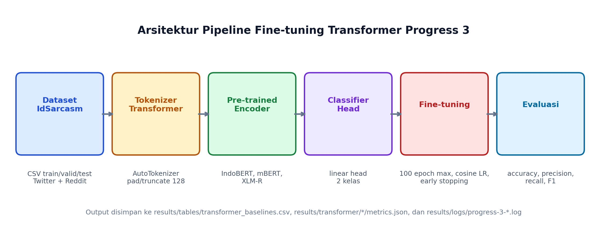
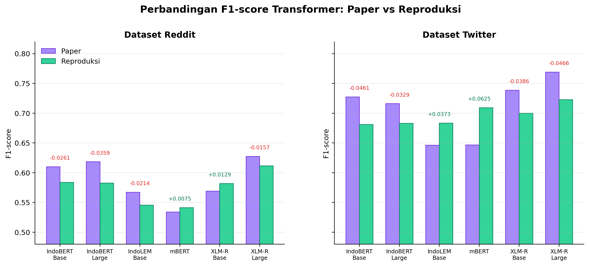
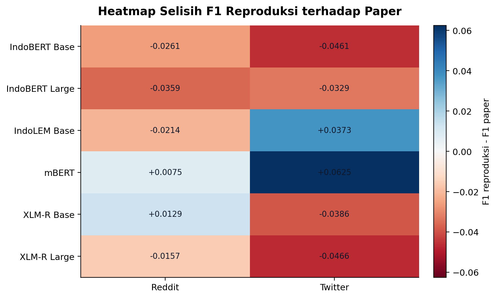
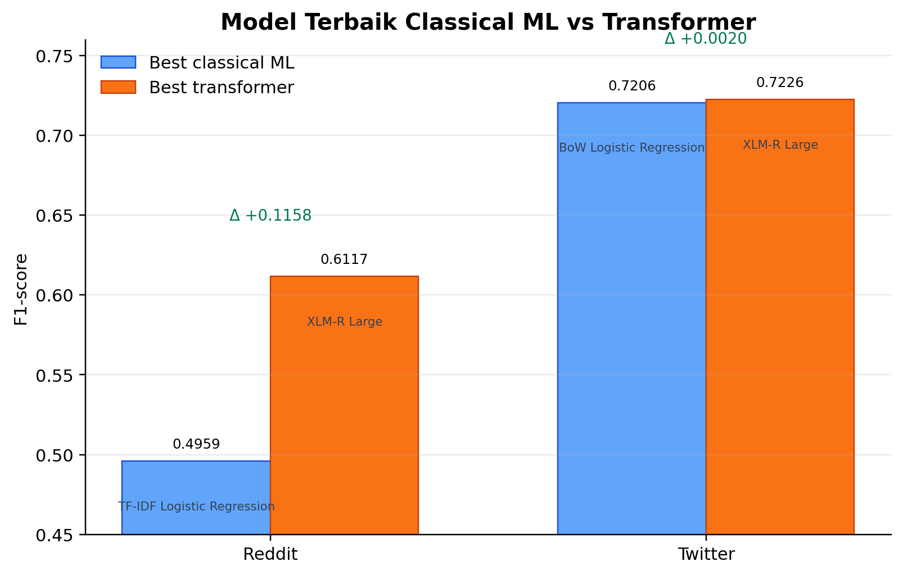
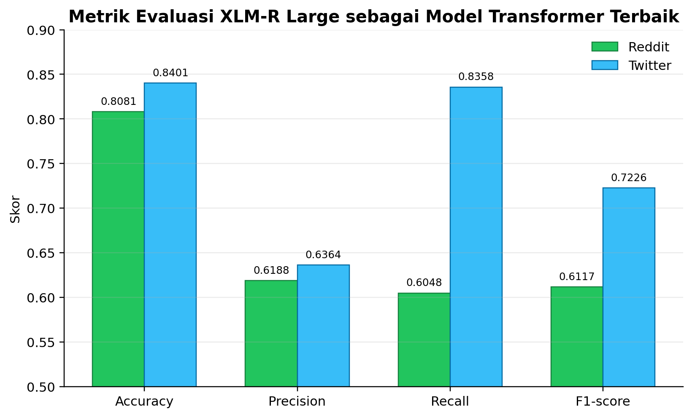

Nama: Febnawan Fatur Rochman
NIM: [ISI NIM]
Kelas: [ISI KELAS]
Mata Kuliah: Pemrosesan Bahasa Alami (NLP)
Dosen: [ISI NAMA DOSEN]

# Laporan Proyek

**Optimasi Performa Model Transformer dalam Klasifikasi Sarkasme Teks Berbahasa Indonesia Berdasarkan Benchmark IdSarcasm**

---

## 1. Latar Belakang Proyek

Sarkasme adalah bentuk ironi di mana penutur bermakna kebalikan dari kata-kata yang diucapkan [1]. Ini menjadi tantangan untuk sistem NLP karena teks yang kelihatannya positif bisa jadi sebenarnya negatif. Akibatnya, analisis sentimen dan moderasi konten bisa salah kesimpulan kalau sarkasme tidak terdeteksi.

Untuk bahasa Inggris, penelitian deteksi sarkasme sudah banyak — dari metode berbasis aturan sampai deep learning [1]. Namun untuk bahasa Indonesia, bidang ini masih tertinggal jauh. Salah satu alasannya karena dataset beranotasi dan benchmark publik untuk bahasa Indonesia masih sedikit [2]. Padahal, pengguna media sosial di Indonesia sangat besar — sekitar 143 juta pengguna aktif per Januari 2025, atau sekitar 50,2% dari total populasi [6]. Hal ini menunjukkan bahwa media sosial Indonesia merupakan sumber data yang potensial untuk kajian sarkasme berbahasa Indonesia, termasuk dari komentar politik, humor, sampai percakapan sehari-hari.

Beberapa peneliti sudah mencoba mengatasi hal ini. Lunando dan Purwarianti [2] menggunakan pendekatan klasik untuk deteksi sarkasme di media sosial Indonesia. Ranti dan Girsang [3] menunjukkan CNN bisa lebih baik dari metode klasik. Khotijah *et al.* [4] menggunakan LSTM untuk data Indonesia dan Inggris. Jeremy [7] juga meneliti pengaruh preprocessing terhadap akurasi deteksi sarkasme. Namun, penelitian-penelitian ini belum menghasilkan benchmark yang bisa diakses publik.

Kekurangan ini kemudian diisi oleh Suhartono, Wongso, dan Handoyo [5] lewat paper "IdSarcasm: Benchmarking and Evaluating Language Models for Indonesian Sarcasm Detection". Paper ini memperkenalkan benchmark deteksi sarkasme bahasa Indonesia pertama yang publik, dengan dataset dari Reddit dan Twitter, serta membandingkan tiga kelas model: classical machine learning, fine-tuned pre-trained language models, dan zero-shot large language models.

Proyek ini bertujuan mereproduksi dan mengoptimasi hasil dari paper IdSarcasm [5], dimulai dari baseline classical ML sebagai fondasi, lalu diperluas ke model transformer beserta optimasi performanya.

---

## 2. Analisis Proyek

### 2.1 Objek dan Dataset

Objek penelitian dalam proyek ini adalah teks berbahasa Indonesia yang mengandung sarkasme, yang bersumber dari dua platform media sosial yaitu Reddit dan Twitter. Dataset yang digunakan merupakan dataset benchmark IdSarcasm yang dirilis oleh Suhartono *et al.* [5] melalui platform HuggingFace. Dataset ini dikumpulkan dari komentar dan cuitan pengguna media sosial Indonesia yang telah dianotasi sebagai sarkastik atau non-sarkastik oleh penulis aslinya.

Dataset Reddit Indonesia Sarcastic terdiri dari 14.116 komentar yang dibagi menjadi tiga subset: train (9.881 data), validasi (1.411 data), dan test (2.824 data). Sementara itu, dataset Twitter Indonesia Sarcastic berisi 2.684 cuitan dengan pembagian train (1.878 data), validasi (268 data), dan test (538 data). Kedua dataset memiliki proporsi kelas yang konsisten di seluruh subset, yaitu 25% label sarkastik dan 75% label non-sarkastik (rasio 1:3). Meskipun secara teknis tidak seimbang, proporsi ini seragam antara train, validasi, dan test, sehingga tidak ada subset yang lebih "berat" dari yang lain [5].

**Gambar 1.** Distribusi label sarkastik dan non-sarkastik pada dataset Reddit dan Twitter.

Selama tahap eksplorasi data awal (Exploratory Data Analysis / EDA), dilakukan pemeriksaan kualitas data yang mencakup pengecekan nilai kosong, duplikasi, dan distribusi panjang teks. Hasilnya menunjukkan bahwa tidak ada nilai kosong pada kedua dataset. Untuk dataset Reddit, ditemukan 10 data duplikat, sedangkan dataset Twitter tidak memiliki duplikat sama sekali. Distribusi panjang teks menunjukkan bahwa rata-rata komentar sarkastik di Reddit cenderung lebih pendek dibandingkan non-sarkastik (67 vs 104 karakter), sementara di Twitter perbedaannya tidak signifikan (118 vs 114 karakter).

**Gambar 2.** Distribusi panjang teks (jumlah karakter) per kelas pada dataset Reddit dan Twitter.

**Gambar 3.** Distribusi jumlah data per subset (train, validasi, test) pada kedua dataset.

Perbedaan ukuran kedua dataset ini cukup mencolok. Dataset Reddit memiliki volume data sekitar lima kali lipat lebih besar dibandingkan Twitter. Ini perlu diperhatikan karena jumlah data yang lebih besar tidak otomatis menghasilkan performa lebih tinggi jika karakteristik teksnya berbeda. Berdasarkan temuan EDA, teks Reddit memiliki variasi panjang yang lebih lebar, sedangkan teks Twitter lebih seragam.

### 2.2 Algoritma atau Metode

Bagian ini diperbarui secara bertahap mengikuti progress proyek. Setelah Progress 2 menutup baseline classical ML, Progress 3 menambahkan baseline fine-tuned transformer yang menjadi inti dari judul proyek.

#### 2.2.1 Baseline Classical Machine Learning (Progress 2)

Untuk Progress 2, tiga algoritma classical machine learning direproduksi sesuai dengan yang digunakan dalam paper IdSarcasm [5], yaitu Logistic Regression, Naive Bayes (Multinomial), dan Support Vector Machine (SVM). Ketiga algoritma ini merupakan baseline standar dalam tugas klasifikasi teks yang telah banyak digunakan dalam penelitian NLP sebelumnya, di antaranya untuk klasifikasi sentimen dan deteksi sarkasme [2][9][13]. Implementasinya menggunakan scikit-learn, yaitu library Python yang umum dipakai untuk eksperimen machine learning klasik [11].

**Logistic Regression (LR)** adalah model klasifikasi linier yang bekerja dengan mempelajari bobot (weight) untuk setiap fitur kata, merepresentasikan seberapa kuat kata tersebut mengindikasikan kelas sarkastik atau non-sarkastik. Hyperparameter utama yang digunakan adalah **C**, yaitu parameter yang mengontrol seberapa ketat model mengikuti data latih. C kecil (misalnya 0,01) berarti regularisasi kuat, model lebih sederhana dan tidak overfit. Sebaliknya, C besar (misalnya 100) membuat model lebih fleksibel tapi berisiko overfitting. Rentang C pada paper adalah [0,01, 0,1, 1, 10, 100] [5].

**Naive Bayes (Multinomial NB)** adalah algoritma klasifikasi probabilistik yang sederhana tapi sering jadi baseline yang kompetitif dalam klasifikasi teks [9]. Hyperparameter utamanya adalah **alpha** (α), yaitu parameter smoothing Laplace yang mengatur bagaimana model menangani kata-kata yang tidak muncul saat training. Alpha terlalu kecil membuat model tergantung pada frekuensi kata yang terlihat, alpha terlalu besar membuat distribusi terlalu seragam. Pada paper, alpha dicari dalam rentang 0,001 sampai 1 menggunakan `linspace` [5].

**Support Vector Machine (SVM)** atau Support Vector Classification (SVC) adalah algoritma yang mencari boundary terbaik antara dua kelas dalam ruang fitur [10]. SVM efektif untuk klasifikasi teks karena mampu menangani dimensi fitur yang tinggi. Hyperparameter yang digunakan meliputi **C** (parameter regularisasi, sama seperti LR) dan **kernel** yang menentukan bentuk boundary. Dua kernel dievaluasi: **linear** (pemisahan garis lurus) dan **rbf** (Radial Basis Function, yang bisa menangkap pola non-linear) [5].

Untuk representasi fitur, digunakan **Bag of Words (BoW)** dan **TF-IDF** (Term Frequency-Inverse Document Frequency). BoW merepresentasikan setiap dokumen sebagai vektor frekuensi kemunculan kata dalam vocabulary. TF-IDF memberikan bobot lebih tinggi pada kata yang sering muncul di satu dokumen tapi jarang di dokumen lain, sehingga kata umum seperti "dan" atau "yang" mendapat bobot rendah [8]. Tokenisasi menggunakan `nltk.word_tokenize` untuk memecah kalimat menjadi token kata.

#### 2.2.2 Model Transformer (Progress 3)

Pada Progress 3, eksperimen diperluas dari model classical ML ke model transformer. Transformer adalah arsitektur deep learning berbasis attention, yaitu mekanisme yang membuat model bisa memberi bobot berbeda pada kata-kata di dalam kalimat sesuai konteksnya [15]. Dalam tugas deteksi sarkasme, hal ini penting karena makna sarkastik sering tidak muncul dari satu kata saja, tetapi dari hubungan antar kata, gaya kalimat, dan konteks implisit.

Model transformer yang digunakan pada Progress 3 mengikuti baseline fine-tuned pre-trained language models dari paper IdSarcasm [5]. Istilah pre-trained berarti model sudah dilatih terlebih dahulu pada korpus teks besar, lalu diadaptasi lagi untuk tugas spesifik melalui fine-tuning. Fine-tuning di proyek ini berarti melatih ulang model pada dataset IdSarcasm dengan label biner: 0 untuk non-sarkastik dan 1 untuk sarkastik. Head bawaan model untuk tugas asal digantikan dengan classification head untuk klasifikasi biner, yaitu layer linear yang menghasilkan prediksi dua kelas.

Enam model baseline transformer yang dijalankan adalah IndoBERT Base (IndoNLU), IndoBERT Large (IndoNLU), IndoBERT Base (IndoLEM), mBERT, XLM-R Base, dan XLM-R Large. IndoBERT dan mBERT masih berada dalam keluarga BERT, yaitu model encoder yang umum dipakai untuk tugas klasifikasi teks [16]. XLM-R merupakan model multilingual berbasis RoBERTa yang dilatih untuk banyak bahasa dan sering kuat pada tugas lintas bahasa [17]. IndoLEM dipakai karena memang disiapkan untuk beberapa tugas NLP bahasa Indonesia [18].

Berbeda dengan classical ML yang memakai BoW atau TF-IDF, transformer tidak memakai fitur frekuensi kata secara langsung. Teks terlebih dahulu diubah menjadi token subword oleh tokenizer, lalu token tersebut masuk ke encoder transformer. Dengan cara ini, model dapat memanfaatkan representasi kata yang lebih kontekstual. Misalnya kata yang sama bisa punya bobot berbeda tergantung kalimatnya. Ini lebih cocok untuk sarkasme dibanding hanya menghitung frekuensi kata, walaupun tetap tidak menjamin model selalu memahami maksud sarkastik dengan benar.

### 2.3 Analisis Kebutuhan Proyek

Untuk menjalankan eksperimen baseline classical ML, dibutuhkan Python 3.10+ dengan pustaka scikit-learn, pandas, nltk, dan dataset dari HuggingFace yang di-cache lokal. Untuk perangkat keras, eksperimen classical ML tidak butuh GPU dan bisa dijalankan di komputer lokal standar (i5-12400F, 16GB RAM) dalam waktu beberapa menit.

Untuk eksperimen transformer pada Progress 3, kebutuhan komputasinya jauh lebih besar. Library utama yang dipakai adalah PyTorch, HuggingFace Transformers, Datasets, Evaluate, Accelerate, dan scikit-learn. Training dijalankan melalui Google Colab GPU karena fine-tuning enam model pada dua dataset membutuhkan akselerasi GPU. Model besar seperti XLM-R Large memiliki parameter jauh lebih banyak dibanding model classical ML, sehingga tidak realistis jika dijalankan cepat di CPU lokal.

Kebutuhan penyimpanan juga bertambah. Hasil metrik disimpan di `results/tables/transformer_baselines.csv`, ringkasan setiap run disimpan di `results/transformer/*/metrics.json` dan `result_row.json`, sedangkan log Colab disimpan di `results/logs/`. Folder checkpoint model tidak dimasukkan ke Git karena ukurannya besar. Yang dimasukkan ke repo hanya hasil, log, script, notebook, dan figure agar laporan tetap bisa diverifikasi.

---

## 3. Pemodelan/Sistem/Aplikasi

### 3.1 Ilustrasi atau Arsitektur Projek

Alur kerja (pipeline) eksperimen classical ML pada proyek ini terdiri dari beberapa tahap utama yang saling berurutan. Pertama, data mentah dimuat dari file CSV yang telah di-cache secara lokal. Kemudian, teks diproses melalui tahap tokenisasi menggunakan `nltk.word_tokenize` untuk memecah kalimat menjadi kata-kata individual. Setelah itu, teks yang sudah ditokenisasi direpresentasikan sebagai vektor numerik menggunakan Bag of Words (CountVectorizer) atau TF-IDF (TfidfVectorizer). Vektor fitur ini kemudian digunakan untuk melatih model klasifikasi (LR, NB, atau SVM) dengan pencarian hyperparameter melalui GridSearchCV. Terakhir, model terbaik dievaluasi pada subset test menggunakan metrik accuracy, precision, recall, dan F1-score.

**Gambar 4.** Arsitektur pipeline eksperimen classical ML dari pemuatan data hingga evaluasi model.

Setelah Progress 3, pipeline proyek bertambah dengan jalur fine-tuning transformer. Jalur ini tetap dimulai dari dataset IdSarcasm, tetapi setelah data dimuat, teks diproses oleh tokenizer milik masing-masing model. Token tersebut kemudian masuk ke encoder transformer, dilanjutkan ke classifier head, lalu model dievaluasi dengan metrik yang sama: accuracy, precision, recall, dan F1-score.

**Gambar 5.** Arsitektur pipeline eksperimen transformer pada Progress 3 dari dataset sampai evaluasi.

### 3.2 Tahapan

#### 3.2.1 Tahapan Eksperimen Classical ML (Progress 2)

Eksperimen dilaksanakan dalam beberapa tahap sebagai berikut:

1. Dataset dimuat dari HuggingFace dan disimpan dalam format CSV lokal, termasuk pembagian data menjadi subset train, validasi, dan test sesuai split dari paper.
2. Dilakukan tahap EDA untuk memahami karakteristik dataset, termasuk distribusi kelas, panjang teks, dan kualitas data.
3. Teks diproses melalui tokenisasi dan vektorisasi menggunakan BoW (CountVectorizer) atau TF-IDF (TfidfVectorizer).
4. Ketiga model (LR, NB, SVM) dilatih menggunakan GridSearchCV dengan PredefinedSplit untuk menemukan kombinasi hyperparameter terbaik pada masing-masing dataset dan metode vektorisasi. Train dan validasi digabung, lalu PredefinedSplit digunakan agar validasi tetap jadi holdout selama pencarian, konsisten dengan pendekatan paper.
5. Model dengan hyperparameter terbaik dievaluasi pada subset test untuk menghitung accuracy, precision, recall, dan F1-score.

Untuk memastikan reproduktibilitas, seluruh proses eksperimen dijalankan melalui skrip Python (`scripts/run_classical_baselines.py`) yang dapat dijalankan ulang secara konsisten. Hasil evaluasi disimpan dalam format CSV di direktori `results/tables/` untuk kemudian dianalisis dan dibandingkan dengan hasil yang dilaporkan paper.

#### 3.2.2 Tahapan Eksperimen Transformer (Progress 3)

Eksperimen transformer Progress 3 dijalankan sebagai paper baseline complete untuk fine-tuned transformer. Awalnya scope hanya diarahkan ke satu atau dua model pada dataset Twitter. Setelah runner dan notebook Colab stabil, scope diperluas menjadi 12 run, yaitu 6 model pada 2 dataset: Twitter dan Reddit. Dengan begitu, hasil Progress 3 tidak hanya menunjukkan satu baseline kecil, tetapi sudah bisa dibandingkan langsung dengan tabel transformer pada paper IdSarcasm [5].

Tahapan eksperimen dilakukan sebagai berikut:

1. Source code asli paper pada folder `source-code/original-id-sarcasm/` dibaca kembali, terutama recipe baseline di `recipes/twitter/baseline/` dan `recipes/reddit/baseline/`. Tujuannya agar konfigurasi training tidak asal berbeda dari paper.
2. Runner `scripts/run_transformer_baseline.py` disiapkan untuk menjalankan fine-tuning HuggingFace Transformers dengan output yang lebih rapi untuk repo ini. Runner tersebut tetap mengikuti konfigurasi utama paper, tetapi tidak melakukan `push_to_hub` karena project UAS hanya membutuhkan hasil lokal.
3. Notebook `notebooks/02_transformer_baseline_colab.ipynb` dipakai sebagai tempat eksekusi Colab. Notebook ini berisi smoke test, full run, dan bagian ringkasan hasil.
4. Setiap teks diproses menggunakan tokenizer model masing-masing dengan `max_length=128` dan padding ke panjang maksimum.
5. Training dilakukan dengan learning rate 1e-5, batch size train 32, batch size evaluasi 64, scheduler cosine, weight decay 0,03, maksimum 100 epoch, seed 42, dan early stopping. Early stopping berarti training dihentikan lebih awal jika metrik validasi tidak membaik lagi, sehingga model tidak terus dilatih sampai overfit.
6. Evaluasi akhir dilakukan pada test set untuk memperoleh accuracy, precision, recall, dan F1-score. Nilai F1 tetap dipakai sebagai metrik utama karena kelas sarkastik hanya 25% dari data.
7. Semua hasil full run dipastikan memiliki `sample_limited=false`, sehingga tidak tercampur dengan smoke test. Smoke test disimpan terpisah di `results/tables/transformer_smoke.csv`.

Konfigurasi ini dibuat sedekat mungkin dengan acuan konfigurasi paper. Perbedaan yang sengaja dipertahankan hanya pada sisi operasional, seperti tidak mengunggah model ke HuggingFace Hub dan tidak menyimpan checkpoint besar ke repo. Ringkasan konfigurasi utama ditunjukkan pada Tabel 1.

**Tabel 1.** Ringkasan Konfigurasi Fine-tuning Transformer Progress 3

| Komponen | Konfigurasi Progress 3 | Catatan |
|----------|------------------------|---------|
| Dataset | Twitter dan Reddit IdSarcasm | Menggunakan split train, validasi, dan test dari benchmark |
| Model | 6 baseline transformer paper | IndoBERT, mBERT, XLM-R, termasuk varian base/large |
| Max length | 128 token | Sama dengan recipe baseline paper |
| Batch size | Train 32, eval 64 | Mengikuti acuan konfigurasi paper dan dijalankan di Colab GPU |
| Learning rate | 1e-5 | Dipadukan dengan scheduler cosine |
| Weight decay | 0,03 | Digunakan untuk mengurangi overfitting |
| Epoch maksimum | 100 | Training dapat berhenti lebih awal karena early stopping |
| Early stopping | Patience 3, threshold 0,01 | Berhenti jika metrik validasi tidak membaik setelah beberapa evaluasi |
| Metric utama | F1-score | Dipilih karena kelas sarkastik hanya 25% dari data |
| Padding | Pad to max length | Membuat panjang input konsisten untuk batching |
| FP16 | Aktif saat CUDA tersedia | Membantu efisiensi memori dan waktu training di GPU |

#### 3.2.3 Tahapan Zero-shot LLM (Progress 4 — akan ditambahkan)

(Akan diisi setelah eksperimen zero-shot LLM selesai. Progress 4 direncanakan terpisah karena workflow-nya berupa inference/prompting, bukan fine-tuning transformer.)

### 3.3 Hasil dan Evaluasi

#### 3.3.1 Hasil Baseline Classical ML (Progress 2)

Untuk mengevaluasi performa model, digunakan empat metrik klasifikasi standar: accuracy, precision, recall, dan F1-score [12][14]. **Accuracy** mengukur proporsi prediksi yang benar dari seluruh data test. **Precision** mengukur dari semua yang diprediksi sarkastik, berapa persen yang benar-benar sarkastik. **Recall** mengukur dari semua data sarkastik, berapa persen yang berhasil dideteksi model. **F1-score** adalah rata-rata harmonik precision dan recall, menjadikannya metrik utama dalam paper IdSarcasm karena menyeimbangkan keduanya pada dataset yang tidak seimbang [5][12].

Berikut adalah hasil eksperimen baseline classical ML pada dataset Twitter:

**Tabel 2.** Hasil Eksperimen pada Dataset Twitter

| Vektorisasi | Model | Best Params | Accuracy | Precision | Recall | F1-Score |
|-------------|-------|-------------|----------|-----------|--------|----------|
| BoW | Logistic Regression | C=100 | 0,8587 | 0,7101 | 0,7313 | 0,7206 |
| BoW | Naive Bayes | α=0,450 | 0,8532 | 0,7570 | 0,6045 | 0,6722 |
| BoW | SVM | C=100, kernel=rbf | 0,8513 | 0,7250 | 0,6493 | 0,6850 |
| TF-IDF | Logistic Regression | C=10 | 0,8662 | 0,7627 | 0,6716 | 0,7143 |
| TF-IDF | Naive Bayes | α=0,103 | 0,8197 | 0,7761 | 0,3881 | 0,5174 |
| TF-IDF | SVM | C=10, kernel=rbf | 0,8625 | 0,8125 | 0,5821 | 0,6783 |

**Gambar 6.** Perbandingan F1-score antar model pada dataset Twitter untuk metode vektorisasi BoW dan TF-IDF.

Berikut adalah hasil eksperimen pada dataset Reddit:

**Tabel 3.** Hasil Eksperimen pada Dataset Reddit

| Vektorisasi | Model | Best Params | Accuracy | Precision | Recall | F1-Score |
|-------------|-------|-------------|----------|-----------|--------|----------|
| BoW | Logistic Regression | C=1 | 0,7840 | 0,6000 | 0,4079 | 0,4857 |
| BoW | Naive Bayes | α=0,531 | 0,7890 | 0,6389 | 0,3584 | 0,4592 |
| BoW | SVM | C=0,1, kernel=linear | 0,7851 | 0,6592 | 0,2904 | 0,4031 |
| TF-IDF | Logistic Regression | C=10 | 0,7847 | 0,5980 | 0,4235 | 0,4959 |
| TF-IDF | Naive Bayes | α=0,062 | 0,7776 | 0,6500 | 0,2394 | 0,3499 |
| TF-IDF | SVM | C=1, kernel=linear | 0,7886 | 0,6461 | 0,3414 | 0,4467 |

**Gambar 7.** Perbandingan F1-score antar model pada dataset Reddit untuk metode vektorisasi BoW dan TF-IDF.

Untuk memvalidasi reproduktibilitas, hasil eksperimen dibandingkan dengan target F1-score yang dilaporkan dalam paper IdSarcasm [5]:

**Tabel 4.** Perbandingan Hasil Reproduksi vs Paper (TF-IDF)

| Model | Twitter Paper | Twitter Reproduksi | Selisih | Reddit Paper | Reddit Reproduksi | Selisih |
|-------|--------------|-------------------|---------|-------------|-------------------|---------|
| Logistic Regression | 0,7142 | 0,7143 | +0,0001 | 0,4887 | 0,4959 | +0,0072 |
| Naive Bayes | 0,6721 | 0,5174 | -0,1547 | 0,4591 | 0,3499 | -0,1092 |
| SVM | 0,6782 | 0,6783 | +0,0001 | 0,4467 | 0,4467 | 0,0000 |

**Gambar 8.** Perbandingan F1-score hasil reproduksi dengan target paper pada dataset Twitter dan Reddit menggunakan TF-IDF.

Dari tabel perbandingan di atas, terlihat bahwa reproduksi untuk Logistic Regression dan SVM pada dataset Twitter menghasilkan F1-score yang sangat mendekati bahkan identik dengan yang dilaporkan paper. Hal ini menunjukkan bahwa implementasi eksperimen berhasil mereproduksi hasil paper dengan baik untuk kedua model tersebut. Untuk Logistic Regression pada dataset Reddit, hasil reproduksi sedikit di atas target paper (+0,0072), yang kemungkinan disebabkan oleh perbedaan versi pustaka atau seed random yang berbeda saat GridSearchCV.

Namun, untuk Naive Bayes terdapat gap yang cukup besar, terutama pada dataset Twitter (-0,1547) dan Reddit (-0,1092). Salah satu dugaan penyebabnya adalah perbedaan versi atau karakteristik dataset. Paper IdSarcasm [5] menggunakan dataset Twitter versi asli yang berisi 12.861 data tidak seimbang, sedangkan versi benchmark yang dirilis di HuggingFace dan digunakan di reproduksi ini hanya 2.684 data dengan rasio kelas 25:75. Naive Bayes juga lebih bergantung pada distribusi frekuensi kata, sehingga perubahan ukuran dan distribusi data dapat memengaruhi hasilnya. Meskipun demikian, pola umum hasil tetap konsisten dengan paper: Logistic Regression dan SVM cenderung lebih baik dari Naive Bayes, dan TF-IDF umumnya lebih stabil dibandingkan BoW.

#### 3.3.2 Hasil Model Transformer (Progress 3)

Progress 3 menghasilkan 12 baseline fine-tuned transformer: enam model pada dataset Reddit dan enam model pada dataset Twitter. Keenam model tersebut adalah IndoBERT Base (IndoNLU), IndoBERT Large (IndoNLU), IndoBERT Base (IndoLEM), mBERT, XLM-R Base, dan XLM-R Large. Hasil utama dapat dilihat pada Tabel 5.

**Tabel 5.** Hasil Reproduksi Baseline Transformer Progress 3

| Model | Reddit Paper | Reddit Reproduksi | Selisih | Twitter Paper | Twitter Reproduksi | Selisih |
|-------|-------------:|------------------:|--------:|--------------:|-------------------:|--------:|
| IndoBERT Base (IndoNLU) | 0,6100 | 0,5839 | -0,0261 | 0,7273 | 0,6812 | -0,0461 |
| IndoBERT Large (IndoNLU) | 0,6184 | 0,5825 | -0,0359 | 0,7160 | 0,6831 | -0,0329 |
| IndoBERT Base (IndoLEM) | 0,5671 | 0,5457 | -0,0214 | 0,6462 | 0,6835 | +0,0373 |
| mBERT | 0,5338 | 0,5413 | +0,0075 | 0,6467 | 0,7092 | +0,0625 |
| XLM-R Base | 0,5690 | 0,5819 | +0,0129 | 0,7386 | 0,7000 | -0,0386 |
| XLM-R Large | 0,6274 | 0,6117 | -0,0157 | 0,7692 | 0,7226 | -0,0466 |

**Gambar 9.** Perbandingan F1-score baseline transformer antara paper dan hasil reproduksi Progress 3.

Berdasarkan hasil tersebut, model terbaik pada kedua dataset adalah XLM-R Large. Pada Reddit, XLM-R Large memperoleh F1-score 0,6117, sedangkan target paper adalah 0,6274. Selisihnya -0,0157, jadi masih cukup dekat. Pada Twitter, XLM-R Large memperoleh F1-score 0,7226, lebih rendah dari paper 0,7692 dengan selisih -0,0466. Walaupun belum menyamai paper, urutan model terbaik tetap masuk akal karena XLM-R Large juga menjadi model terbaik pada paper IdSarcasm [5].

**Gambar 10.** Heatmap selisih F1-score hasil reproduksi terhadap paper untuk setiap model dan dataset.

Ada beberapa pola yang menarik. Pada Reddit, gap reproduksi cenderung kecil. IndoBERT Base, IndoBERT Large, dan IndoLEM Base memang masih di bawah paper, tetapi XLM-R Base dan mBERT justru sedikit di atas paper. Hasil ini mengindikasikan bahwa pipeline reproduksi yang digunakan sudah menghasilkan performa yang relatif dekat dengan paper pada beberapa model. Pada Twitter, hasilnya lebih campuran. mBERT dan IndoLEM Base berada di atas paper, tetapi IndoBERT Base, IndoBERT Large, XLM-R Base, dan XLM-R Large masih di bawah paper.

Perbedaan ini kemungkinan dipengaruhi oleh beberapa hal. Pertama, training transformer lebih sensitif terhadap versi library, GPU, seed, dan detail implementasi kecil dibanding classical ML. Kedua, beberapa checkpoint IndoBERT/IndoLEM menampilkan warning kompatibilitas `LayerNorm.gamma/beta` terhadap format Transformers versi baru. Training tetap selesai, tetapi warning ini menunjukkan bahwa checkpoint lama dan library baru tidak sepenuhnya identik. Ketiga, data Twitter yang tersedia di HuggingFace adalah versi benchmark 2.684 data dengan rasio 1:3, sehingga perubahan kecil pada hasil prediksi dapat memengaruhi F1-score.

Jika dibandingkan dengan baseline classical ML terbaik, peningkatan transformer paling terlihat pada Reddit. Baseline classical terbaik Reddit adalah TF-IDF Logistic Regression dengan F1-score 0,4959, sedangkan XLM-R Large mencapai 0,6117. Kenaikannya +0,1158. Untuk Twitter, baseline classical terbaik adalah BoW Logistic Regression dengan F1-score 0,7206, sedangkan XLM-R Large mencapai 0,7226. Kenaikannya hanya +0,0020. Jadi, pada Twitter, model classical yang sederhana masih mampu bersaing dengan transformer terbaik pada reproduksi ini.

**Tabel 6.** Perbandingan Model Terbaik Classical ML dan Transformer

| Dataset | Best Classical ML | F1 Classical | Best Transformer | F1 Transformer | Selisih |
|---------|-------------------|-------------:|------------------|---------------:|--------:|
| Reddit | TF-IDF Logistic Regression | 0,4959 | XLM-R Large | 0,6117 | +0,1158 |
| Twitter | BoW Logistic Regression | 0,7206 | XLM-R Large | 0,7226 | +0,0020 |

**Gambar 11.** Perbandingan model terbaik classical ML dan model terbaik transformer pada masing-masing dataset.

Hasil ini penting untuk interpretasi proyek. Transformer memang unggul, tetapi tidak selalu dengan margin besar. Temuan ini mengindikasikan bahwa transformer berpotensi lebih membantu pada teks Reddit yang relatif lebih panjang dan lebih kontekstual, meskipun dugaan ini masih perlu dikonfirmasi melalui analisis error yang lebih rinci. Model berbasis representasi kontekstual seperti XLM-R dapat menangkap pola yang tidak mudah ditangkap oleh TF-IDF. Pada Twitter, teks lebih pendek dan beberapa pola sarkasme kemungkinan dapat tertangkap oleh kata atau frasa tertentu, sehingga Logistic Regression dengan BoW mendekati performa XLM-R Large.

Untuk melihat karakter model terbaik, metrik XLM-R Large ditampilkan pada Gambar 12. Pada Twitter, recall XLM-R Large mencapai 0,8358, lebih tinggi dari precision 0,6364. Artinya, model cukup agresif menangkap kelas sarkastik, tetapi sebagian prediksi sarkastik masih salah. Pada Reddit, precision dan recall XLM-R Large lebih seimbang, yaitu 0,6188 dan 0,6048. Ini menunjukkan performa Reddit lebih merata, meskipun F1 keseluruhannya masih lebih rendah daripada Twitter.

**Gambar 12.** Accuracy, precision, recall, dan F1-score XLM-R Large pada dataset Reddit dan Twitter.

Keterbatasan Progress 3 tetap perlu dicatat. Pertama, setiap model dijalankan dengan satu seed utama, yaitu seed 42, sehingga laporan ini belum mengukur variasi hasil antar seed. Kedua, analisis error belum dilakukan, jadi penjelasan tentang kenapa model tertentu lebih unggul masih berupa interpretasi awal dari metrik, bukan kesimpulan final. Ketiga, beberapa checkpoint lama menampilkan warning kompatibilitas saat dijalankan dengan versi Transformers yang lebih baru. Keempat, checkpoint model tidak disimpan di repo karena ukurannya besar, sehingga verifikasi difokuskan pada script, notebook, log, dan file metrik.

Secara teknis, Progress 3 sudah selesai karena semua model paper untuk kategori fine-tuned transformer berhasil dijalankan, hasilnya tersimpan, dan gap terhadap paper dapat dianalisis. Secara metodologis, eksperimen ini sudah mengacu pada acuan konfigurasi paper, dengan keterbatasan seperti yang dijelaskan di atas. Fokus berikutnya bukan lagi menambah baseline transformer, tetapi masuk ke Progress 4, yaitu baseline zero-shot LLM atau eksperimen lanjutan yang berbeda dari fine-tuning transformer.

#### 3.3.3 Hasil Zero-shot LLM (Progress 4 — akan ditambahkan)

(Tabel dan pembahasan hasil zero-shot LLM akan ditambahkan di sini setelah eksperimen Progress 4 selesai.)

#### 3.3.4 Analisis Komparatif (Progress 5 — akan ditambahkan)

(Perbandingan seluruh hasil - classical ML vs transformer vs optimized - dan error analysis akan ditambahkan di sini setelah Progress 5 selesai.)

---

## 4. Rencana Pengembangan Proyek

(Subbab ini akan diperbarui setiap progress.)

Berdasarkan Progress 3, baseline fine-tuned transformer sudah selesai lebih luas dari rencana awal. Tidak hanya IndoBERT Base atau XLM-R Base pada Twitter, tetapi seluruh baseline transformer paper sudah dijalankan pada Twitter dan Reddit. Hasil terbaik adalah XLM-R Large dengan F1-score 0,6117 pada Reddit dan 0,7226 pada Twitter.

Rencana berikutnya adalah Progress 4, yaitu baseline zero-shot LLM. Bagian ini dipisahkan dari transformer fine-tuning karena cara kerjanya berbeda. Fine-tuning melatih ulang model dengan data berlabel, sedangkan zero-shot meminta model menjawab langsung melalui prompt tanpa training tambahan pada dataset IdSarcasm. Jika resource memungkinkan, Progress 4 dapat mencoba model BLOOMZ atau mT0 seperti paper. Alternatif yang lebih realistis adalah menjalankan model lokal melalui LM Studio sebagai zero-shot local LLM baseline, dengan catatan hasilnya tidak disebut reproduksi exact jika modelnya berbeda dari paper.

Setelah zero-shot baseline tersedia, Progress 5 dapat diarahkan ke analisis komparatif dan error analysis. Pada tahap itu, hasil classical ML, transformer, dan zero-shot dapat dibandingkan secara lebih utuh untuk menjawab pertanyaan utama proyek: kapan transformer benar-benar memberi keuntungan, dataset mana yang paling sulit, dan jenis kesalahan apa yang masih sering terjadi pada deteksi sarkasme bahasa Indonesia.

---

## 5. Referensi

[1] A. Joshi, P. Bhattacharyya, and M. J. Carman, "Automatic Sarcasm Detection: A Survey," *ACM Computing Surveys*, vol. 50, no. 5, art. no. 73, pp. 1-22, 2017, doi: 10.1145/3124420.

[2] E. Lunando and A. Purwarianti, "Indonesian Social Media Sentiment Analysis with Sarcasm Detection," in *2013 International Conference on Advanced Computer Science and Information Systems (ICACSIS)*, Bali, Indonesia, 2013, pp. 195-198, doi: 10.1109/ICACSIS.2013.6761557.

[3] K. S. Ranti and A. S. Girsang, "Indonesian Sarcasm Detection Using Convolutional Neural Network," *International Journal of Emerging Trends in Engineering Research*, vol. 8, no. 9, pp. 6448-6453, 2020, doi: 10.30534/ijeter/2020/10892020.

[4] K. Khotijah, J. Tirtawangsa, and A. B. W. Putra, "Using LSTM for Context Based Approach of Sarcasm Detection in Indonesian and English," in *2020 International Conference on Data Science and Its Applications (ICoDSA)*, Bandung, Indonesia, 2020, pp. 1-6, doi: 10.1109/ICoDSA50139.2020.9212955.

[5] D. Suhartono, W. Wongso, and A. T. Handoyo, "IdSarcasm: Benchmarking and Evaluating Language Models for Indonesian Sarcasm Detection," *IEEE Access*, vol. 12, pp. 87323-87332, 2024, doi: 10.1109/ACCESS.2024.3416955.

[6] DataReportal, "Digital 2025: Indonesia," Feb. 2025. [Online]. Available: https://datareportal.com/reports/digital-2025-indonesia. [Accessed: Apr. 16, 2026].

[7] N. H. Jeremy, "The Impact of Text Preprocessing in Sarcasm Detection on Indonesian Social Media Contents," *Engineering, Mathematics and Computer Science Journal (EMACS)*, vol. 7, no. 1, 2025, doi: 10.33021/emacs.v7i1.13503.

[8] C. D. Manning, P. Raghavan, and H. Schütze, *Introduction to Information Retrieval*. Cambridge, U.K.: Cambridge University Press, 2008, doi: 10.1017/CBO9780511809071.

[9] A. McCallum and K. Nigam, "A Comparison of Event Models for Naive Bayes Text Classification," in *AAAI-98 Workshop on Learning for Text Categorization*, Madison, WI, USA, 1998, pp. 41-48.

[10] C. Cortes and V. Vapnik, "Support-Vector Networks," *Machine Learning*, vol. 20, no. 3, pp. 273-297, 1995, doi: 10.1007/BF00994018.

[11] F. Pedregosa *et al.*, "Scikit-learn: Machine Learning in Python," *Journal of Machine Learning Research*, vol. 12, pp. 2825-2830, 2011, doi: 10.5555/1953048.2078195.

[12] M. Sokolova and G. Lapalme, "A Systematic Analysis of Performance Measures for Classification Tasks," *Information Processing & Management*, vol. 45, no. 4, pp. 427-437, 2009, doi: 10.1016/j.ipm.2009.03.002.

[13] K. Taha, P. D. Yoo, C. Y. Yeun, D. Homouz, and A. Taha, "A Comprehensive Survey of Text Classification Techniques and Their Research Applications: Observational and Experimental Insights," *Computer Science Review*, vol. 54, art. no. 100664, 2024, doi: 10.1016/j.cosrev.2024.100664.

[14] G. Naidu *et al.*, "Accuracy, Precision, Recall, F1-Score, or MCC? Empirical Evidence from Advanced Statistics, ML, and XAI for Evaluating Business Predictive Models," *Journal of Big Data*, vol. 12, art. no. 1313, 2025, doi: 10.1186/s40537-025-01313-4.

[15] A. Vaswani *et al.*, "Attention Is All You Need," in *Advances in Neural Information Processing Systems*, vol. 30, 2017.

[16] J. Devlin, M.-W. Chang, K. Lee, and K. Toutanova, "BERT: Pre-training of Deep Bidirectional Transformers for Language Understanding," in *Proceedings of NAACL-HLT*, 2019, pp. 4171-4186.

[17] A. Conneau *et al.*, "Unsupervised Cross-lingual Representation Learning at Scale," in *Proceedings of ACL*, 2020, pp. 8440-8451.

[18] F. Koto, A. Rahimi, J. H. Lau, and T. Baldwin, "IndoLEM and IndoBERT: A Benchmark Dataset and Pre-trained Language Model for Indonesian NLP," in *Proceedings of COLING*, 2020, pp. 757-770.
