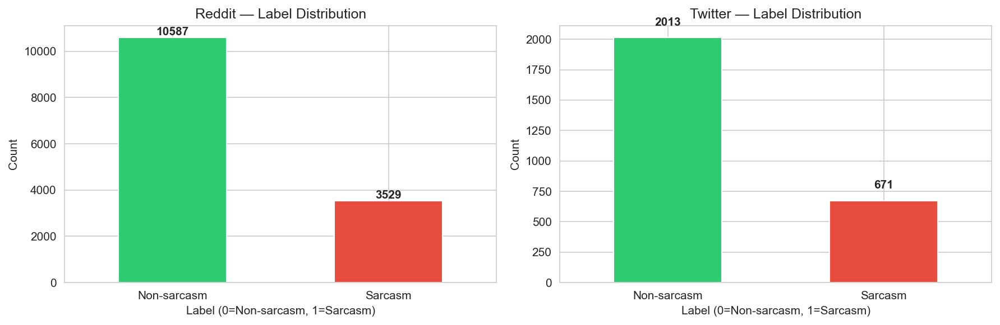
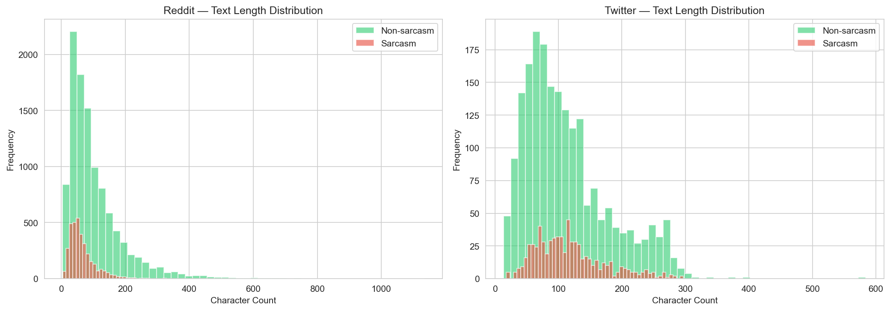
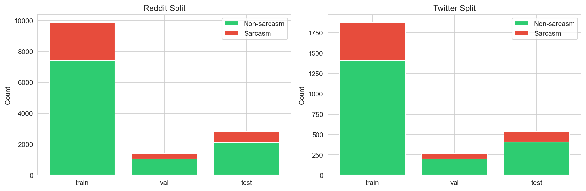
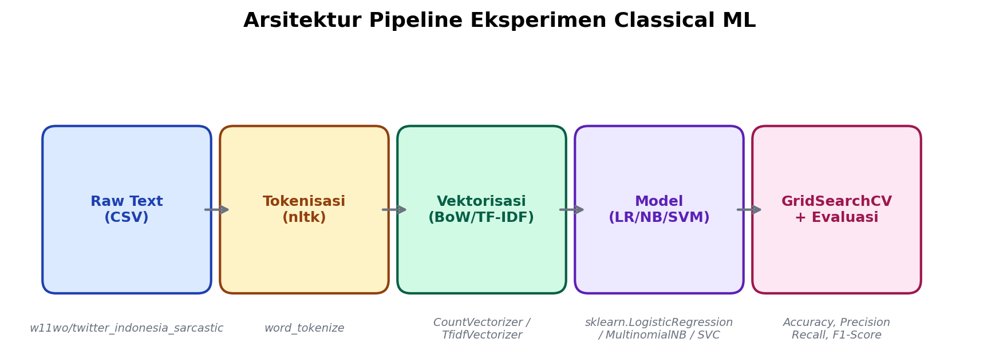
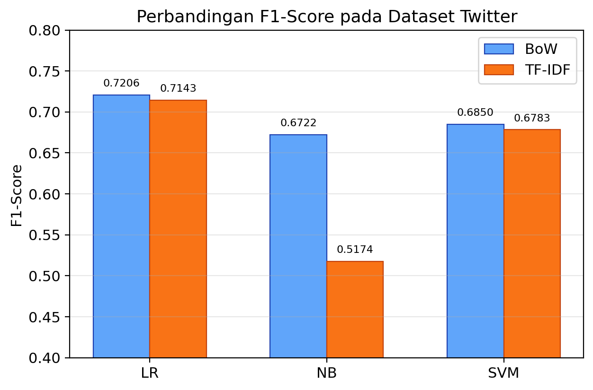
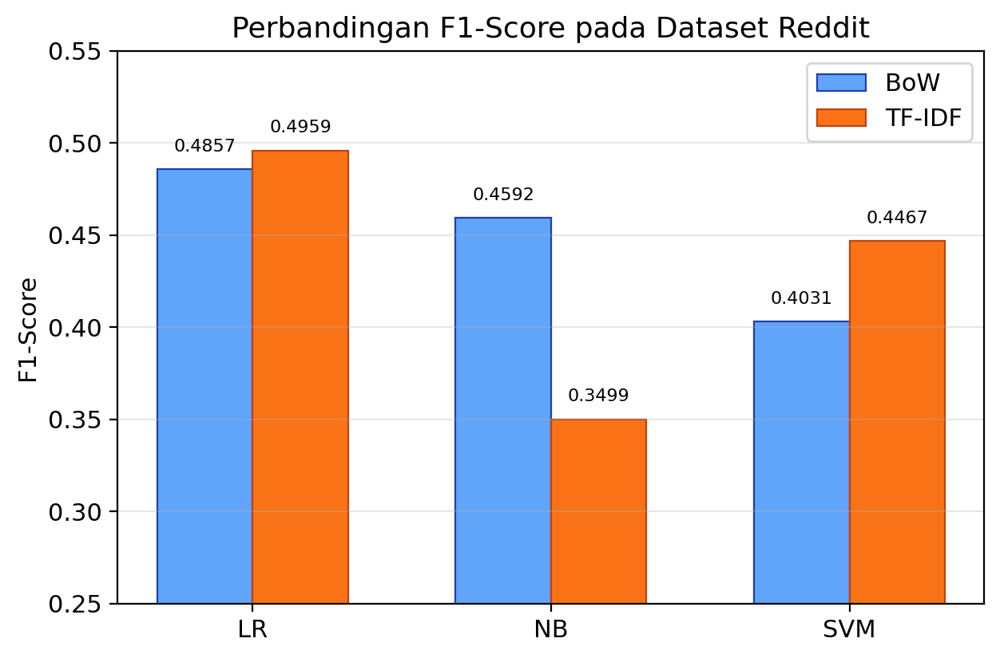
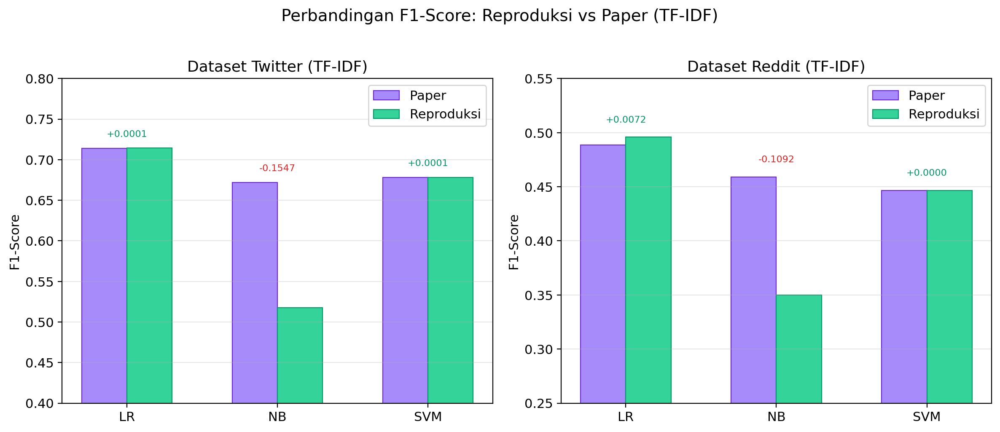

Nama: Febnawan Fatur Rochman
NIM: [ISI NIM]
Kelas: [ISI KELAS]
Mata Kuliah: Pemrosesan Bahasa Alami (NLP)
Dosen: [ISI NAMA DOSEN]

# Laporan Proyek

**Optimasi Performa Model Transformer dalam Klasifikasi Sarkasme Teks Berbahasa Indonesia Berdasarkan Benchmark IdSarcasm**

---

## 1. Latar Belakang Proyek

Sarkasme adalah bentuk ironi di mana penutur bermakna kebalikan dari kata-kata yang diucapkan [1]. Ini jadi masalah buat sistem NLP karena teks yang kelihatannya positif bisa jadi sebenarnya negatif. Akibatnya, analisis sentimen dan moderasi konten bisa salah kesimpulan kalau sarkasme tidak terdeteksi.

Untuk bahasa Inggris, penelitian deteksi sarkasme sudah banyak — dari metode berbasis aturan sampai deep learning [1]. Tapi untuk bahasa Indonesia, bidang ini masih tertinggal jauh. Salah satu alasannya karena dataset beranotasi dan benchmark publik untuk bahasa Indonesia masih sedikit [2]. Padahal, pengguna media sosial di Indonesia sangat besar — sekitar 143 juta pengguna aktif per Januari 2025, atau sekitar 50,2% dari total populasi [6]. Artinya, konten sarkastik di Twitter dan Reddit Indonesia juga banyak, dari komentar politik sampai humor.

Beberapa peneliti sudah coba mengatasi hal ini. Lunando dan Purwarianti [2] pakai pendekatan klasik untuk deteksi sarkasme di media sosial Indonesia. Ranti dan Girsang [3] menunjukkan CNN bisa lebih baik dari metode klasik. Khotijah *et al.* [4] coba pakai LSTM untuk data Indonesia dan Inggris. Jeremy [7] juga meneliti pengaruh preprocessing terhadap akurasi deteksi sarkasme. Tapi penelitian-penelitian ini belum menghasilkan benchmark yang bisa diakses publik.

Kekurangan ini kemudian diisi oleh Suhartono, Wongso, dan Handoyo [5] lewat paper "IdSarcasm: Benchmarking and Evaluating Language Models for Indonesian Sarcasm Detection". Paper ini memperkenalkan benchmark deteksi sarkasme bahasa Indonesia pertama yang publik, dengan dataset dari Reddit dan Twitter, serta membandingkan tiga kelas model: classical machine learning, fine-tuned pre-trained language models, dan zero-shot large language models.

Proyek ini bertujuan mereproduksi dan mengoptimasi hasil dari paper IdSarcasm [5], dimulai dari baseline classical ML sebagai fondasi, lalu diperluas ke model transformer beserta optimasi performanya.

---

## 2. Analisis Proyek

### 2.1 Objek dan Dataset

Objek penelitian dalam proyek ini adalah teks berbahasa Indonesia yang mengandung sarkasme, yang bersumber dari dua platform media sosial yaitu Reddit dan Twitter. Dataset yang digunakan merupakan dataset benchmark IdSarcasm yang dirilis oleh Suhartono *et al.* [5] melalui platform HuggingFace. Dataset ini dikumpulkan dari komentar dan cuitan pengguna media sosial Indonesia yang telah dianotasi sebagai sarkastik atau non-sarkastik oleh penulis aslinya.

Dataset Reddit Indonesia Sarcastic terdiri dari 14.116 komentar yang dibagi menjadi tiga subset: train (9.881 data), validasi (1.411 data), dan test (2.824 data). Sementara itu, dataset Twitter Indonesia Sarcastic berisi 2.684 cuitan dengan pembagian train (1.878 data), validasi (268 data), dan test (538 data). Kedua dataset memiliki proporsi kelas yang konsisten di seluruh subset, yaitu 25% label sarkastik dan 75% label non-sarkastik (rasio 1:3). Meskipun secara teknis tidak seimbang, proporsi ini seragam antara train, validasi, dan test, sehingga tidak ada subset yang lebih "berat" dari yang lain [5].

**Gambar 1.** Distribusi label sarkastik dan non-sarkastik pada dataset Reddit dan Twitter.

Selama tahap eksplorasi data awal (Exploratory Data Analysis / EDA), dilakukan pemeriksaan kualitas data yang mencakup pengecekan nilai kosong, duplikasi, dan distribusi panjang teks. Hasilnya menunjukkan bahwa tidak ada nilai kosong pada kedua dataset. Untuk dataset Reddit, ditemukan 10 data duplikat, sedangkan dataset Twitter tidak memiliki duplikat sama sekali. Distribusi panjang teks menunjukkan bahwa rata-rata komentar sarkastik di Reddit cenderung lebih pendek dibandingkan non-sarkastik (67 vs 104 karakter), sementara di Twitter perbedaannya tidak signifikan (118 vs 114 karakter).

**Gambar 2.** Distribusi panjang teks (jumlah karakter) per kelas pada dataset Reddit dan Twitter.

**Gambar 3.** Distribusi jumlah data per subset (train, validasi, test) pada kedua dataset.

Perbedaan ukuran kedua dataset ini cukup mencolok. Dataset Reddit memiliki volume data sekitar lima kali lipat lebih besar dibandingkan Twitter. Ini perlu diperhatikan karena data lebih banyak belum tentu hasilnya lebih bagus kalau karakteristik teksnya beda. Berdasarkan temuan EDA, teks Reddit memiliki variasi panjang yang lebih lebar, sedangkan teks Twitter lebih seragam.

### 2.2 Algoritma atau Metode

(Akan diperbarui seiring progress. Saat ini baru mencakup algoritma yang digunakan pada Progress 2 - baseline classical ML.)

#### 2.2.1 Baseline Classical Machine Learning (Progress 2)

Untuk Progress 2, tiga algoritma classical machine learning direproduksi sesuai dengan yang digunakan dalam paper IdSarcasm [5], yaitu Logistic Regression, Naive Bayes (Multinomial), dan Support Vector Machine (SVM). Ketiga algoritma ini merupakan baseline standar dalam tugas klasifikasi teks yang telah banyak digunakan dalam penelitian NLP sebelumnya, di antaranya untuk klasifikasi sentimen dan deteksi sarkasme [2][9][13].

**Logistic Regression (LR)** adalah model klasifikasi linier yang bekerja dengan mempelajari bobot (weight) untuk setiap fitur kata, merepresentasikan seberapa kuat kata tersebut mengindikasikan kelas sarkastik atau non-sarkastik. Hyperparameter utama yang digunakan adalah **C**, yaitu parameter yang mengontrol seberapa ketat model mengikuti data latih. C kecil (misalnya 0,01) berarti regularisasi kuat, model lebih sederhana dan tidak overfit. Sebaliknya, C besar (misalnya 100) membuat model lebih fleksibel tapi berisiko overfitting. Rentang C pada paper adalah [0,01, 0,1, 1, 10, 100] [5].

**Naive Bayes (Multinomial NB)** adalah algoritma klasifikasi probabilistik yang sederhana tapi sering jadi baseline yang kompetitif dalam klasifikasi teks [9]. Hyperparameter utamanya adalah **alpha** (α), yaitu parameter smoothing Laplace yang mengatur bagaimana model menangani kata-kata yang tidak muncul saat training. Alpha terlalu kecil membuat model tergantung pada frekuensi kata yang terlihat, alpha terlalu besar membuat distribusi terlalu seragam. Pada paper, alpha dicari dalam rentang 0,001 sampai 1 menggunakan `linspace` [5].

**Support Vector Machine (SVM)** atau Support Vector Classification (SVC) adalah algoritma yang mencari boundary terbaik antara dua kelas dalam ruang fitur [10]. SVM efektif untuk klasifikasi teks karena mampu menangani dimensi fitur yang tinggi. Hyperparameter yang digunakan meliputi **C** (parameter regularisasi, sama seperti LR) dan **kernel** yang menentukan bentuk boundary. Dua kernel dievaluasi: **linear** (pemisahan garis lurus) dan **rbf** (Radial Basis Function, yang bisa menangkap pola non-linear) [5].

Untuk representasi fitur, digunakan **Bag of Words (BoW)** dan **TF-IDF** (Term Frequency-Inverse Document Frequency). BoW merepresentasikan setiap dokumen sebagai vektor frekuensi kemunculan kata dalam vocabulary. TF-IDF memberikan bobot lebih tinggi pada kata yang sering muncul di satu dokumen tapi jarang di dokumen lain, sehingga kata umum seperti "dan" atau "yang" mendapat bobot rendah [8]. Tokenisasi menggunakan `nltk.word_tokenize` untuk memecah kalimat menjadi token kata.

#### 2.2.2 Model Transformer (Progress 3 — akan ditambahkan)

(Akan diisi setelah reproduksi baseline transformer - IndoBERT / XLM-R selesai pada Progress 3.)

### 2.3 Analisis Kebutuhan Proyek

Untuk menjalankan eksperimen baseline classical ML, dibutuhkan Python 3.10+ dengan pustaka scikit-learn, pandas, nltk, dan dataset dari HuggingFace yang di-cache lokal. Untuk perangkat keras, eksperimen classical ML tidak butuh GPU dan bisa dijalankan di komputer lokal standar (i5-12400F, 16GB RAM) dalam waktu beberapa menit.

---

## 3. Pemodelan/Sistem/Aplikasi

### 3.1 Ilustrasi atau Arsitektur Projek

Alur kerja (pipeline) eksperimen classical ML pada proyek ini terdiri dari beberapa tahap utama yang saling berurutan. Pertama, data mentah dimuat dari file CSV yang telah di-cache secara lokal. Kemudian, teks diproses melalui tahap tokenisasi menggunakan `nltk.word_tokenize` untuk memecah kalimat menjadi kata-kata individual. Setelah itu, teks yang sudah ditokenisasi direpresentasikan sebagai vektor numerik menggunakan Bag of Words (CountVectorizer) atau TF-IDF (TfidfVectorizer). Vektor fitur ini kemudian digunakan untuk melatih model klasifikasi (LR, NB, atau SVM) dengan pencarian hyperparameter melalui GridSearchCV. Terakhir, model terbaik dievaluasi pada subset test menggunakan metrik accuracy, precision, recall, dan F1-score.

**Gambar 4.** Arsitektur pipeline eksperimen classical ML dari pemuatan data hingga evaluasi model.

(Arsitektur pipeline untuk model transformer akan ditambahkan pada Progress 3.)

### 3.2 Tahapan

#### 3.2.1 Tahapan Eksperimen Classical ML (Progress 2)

Eksperimen dilaksanakan dalam beberapa tahap sebagai berikut:

1. Dataset dimuat dari HuggingFace dan disimpan dalam format CSV lokal, termasuk pembagian data menjadi subset train, validasi, dan test sesuai split dari paper.
2. Dilakukan tahap EDA untuk memahami karakteristik dataset, termasuk distribusi kelas, panjang teks, dan kualitas data.
3. Teks diproses melalui tokenisasi dan vektorisasi menggunakan BoW (CountVectorizer) atau TF-IDF (TfidfVectorizer).
4. Ketiga model (LR, NB, SVM) dilatih menggunakan GridSearchCV dengan PredefinedSplit untuk menemukan kombinasi hyperparameter terbaik pada masing-masing dataset dan metode vektorisasi. Train dan validasi digabung, lalu PredefinedSplit digunakan agar validasi tetap jadi holdout selama pencarian, konsisten dengan pendekatan paper.
5. Model dengan hyperparameter terbaik dievaluasi pada subset test untuk menghitung accuracy, precision, recall, dan F1-score.

Untuk memastikan reproduktibilitas, seluruh proses eksperimen dijalankan melalui skrip Python (`scripts/run_classical_baselines.py`) yang dapat dijalankan ulang secara konsisten. Hasil evaluasi disimpan dalam format CSV di direktori `results/tables/` untuk kemudian dianalisis dan dibandingkan dengan hasil yang dilaporkan paper.

#### 3.2.2 Tahapan Eksperimen Transformer (Progress 3 — akan ditambahkan)

(Akan diisi setelah reproduksi baseline transformer selesai.)

#### 3.2.3 Tahapan Optimasi (Progress 4 — akan ditambahkan)

(Akan diisi setelah eksperimen optimasi transformer selesai.)

### 3.3 Hasil dan Evaluasi

#### 3.3.1 Hasil Baseline Classical ML (Progress 2)

Untuk mengevaluasi performa model, digunakan empat metrik klasifikasi standar: accuracy, precision, recall, dan F1-score [12][14]. **Accuracy** mengukur proporsi prediksi yang benar dari seluruh data test. **Precision** mengukur dari semua yang diprediksi sarkastik, berapa persen yang benar-benar sarkastik. **Recall** mengukur dari semua data sarkastik, berapa persen yang berhasil dideteksi model. **F1-score** adalah rata-rata harmonik precision dan recall, menjadikannya metrik utama dalam paper IdSarcasm karena menyeimbangkan keduanya pada dataset yang tidak seimbang [5][12].

Berikut adalah hasil eksperimen baseline classical ML pada dataset Twitter:

**Tabel 1.** Hasil Eksperimen pada Dataset Twitter

| Vektorisasi | Model | Best Params | Accuracy | Precision | Recall | F1-Score |
|-------------|-------|-------------|----------|-----------|--------|----------|
| BoW | Logistic Regression | C=100 | 0,8587 | 0,7101 | 0,7313 | 0,7206 |
| BoW | Naive Bayes | α=0,450 | 0,8532 | 0,7570 | 0,6045 | 0,6722 |
| BoW | SVM | C=100, kernel=rbf | 0,8513 | 0,7250 | 0,6493 | 0,6850 |
| TF-IDF | Logistic Regression | C=10 | 0,8662 | 0,7627 | 0,6716 | 0,7143 |
| TF-IDF | Naive Bayes | α=0,103 | 0,8197 | 0,7761 | 0,3881 | 0,5174 |
| TF-IDF | SVM | C=10, kernel=rbf | 0,8625 | 0,8125 | 0,5821 | 0,6783 |

**Gambar 5.** Perbandingan F1-score antar model pada dataset Twitter untuk metode vektorisasi BoW dan TF-IDF.

Berikut adalah hasil eksperimen pada dataset Reddit:

**Tabel 2.** Hasil Eksperimen pada Dataset Reddit

| Vektorisasi | Model | Best Params | Accuracy | Precision | Recall | F1-Score |
|-------------|-------|-------------|----------|-----------|--------|----------|
| BoW | Logistic Regression | C=1 | 0,7840 | 0,6000 | 0,4079 | 0,4857 |
| BoW | Naive Bayes | α=0,531 | 0,7890 | 0,6389 | 0,3584 | 0,4592 |
| BoW | SVM | C=0,1, kernel=linear | 0,7851 | 0,6592 | 0,2904 | 0,4031 |
| TF-IDF | Logistic Regression | C=10 | 0,7847 | 0,5980 | 0,4235 | 0,4959 |
| TF-IDF | Naive Bayes | α=0,062 | 0,7776 | 0,6500 | 0,2394 | 0,3499 |
| TF-IDF | SVM | C=1, kernel=linear | 0,7886 | 0,6461 | 0,3414 | 0,4467 |

**Gambar 6.** Perbandingan F1-score antar model pada dataset Reddit untuk metode vektorisasi BoW dan TF-IDF.

Untuk memvalidasi reproduktibilitas, hasil eksperimen dibandingkan dengan target F1-score yang dilaporkan dalam paper IdSarcasm [5]:

**Tabel 3.** Perbandingan Hasil Reproduksi vs Paper (TF-IDF)

| Model | Twitter Paper | Twitter Reproduksi | Selisih | Reddit Paper | Reddit Reproduksi | Selisih |
|-------|--------------|-------------------|---------|-------------|-------------------|---------|
| Logistic Regression | 0,7142 | 0,7143 | +0,0001 | 0,4887 | 0,4959 | +0,0072 |
| Naive Bayes | 0,6721 | 0,5174 | -0,1547 | 0,4591 | 0,3499 | -0,1092 |
| SVM | 0,6782 | 0,6783 | +0,0001 | 0,4467 | 0,4467 | 0,0000 |

**Gambar 7.** Perbandingan F1-score hasil reproduksi dengan target paper pada dataset Twitter dan Reddit menggunakan TF-IDF.

Dari tabel perbandingan di atas, terlihat bahwa reproduksi untuk Logistic Regression dan SVM pada dataset Twitter menghasilkan F1-score yang sangat mendekati bahkan identik dengan yang dilaporkan paper. Hal ini menunjukkan bahwa implementasi eksperimen berhasil mereproduksi hasil paper dengan baik untuk kedua model tersebut. Untuk Logistic Regression pada dataset Reddit, hasil reproduksi sedikit di atas target paper (+0,0072), yang kemungkinan disebabkan oleh perbedaan versi pustaka atau seed random yang berbeda saat GridSearchCV.

Namun, untuk Naive Bayes terdapat gap yang cukup signifikan, terutama pada dataset Twitter (-0,1547) dan Reddit (-0,1092). Gap besar pada Naive Bayes kemungkinan besar karena perbedaan dataset. Paper IdSarcasm [5] menggunakan dataset Twitter versi asli yang berisi 12.861 data tidak seimbang, sedangkan versi benchmark yang dirilis di HuggingFace dan digunakan di reproduksi ini hanya 2.684 data dengan rasio kelas 25:75. Hal ini karena Naive Bayes lebih bergantung pada distribusi frekuensi kata yang berubah drastis kalau ukuran datanya beda jauh. Meskipun demikian, pola umum hasil tetap konsisten dengan paper: Logistic Regression dan SVM cenderung lebih baik dari Naive Bayes, dan TF-IDF umumnya lebih stabil dibandingkan BoW.

#### 3.3.2 Hasil Model Transformer (Progress 3 — akan ditambahkan)

(Tabel dan pembahasan hasil reproduksi baseline transformer akan ditambahkan di sini setelah eksperimen Progress 3 selesai.)

#### 3.3.3 Hasil Optimasi Transformer (Progress 4 — akan ditambahkan)

(Tabel dan pembahasan hasil optimasi transformer akan ditambahkan di sini setelah eksperimen Progress 4 selesai.)

#### 3.3.4 Analisis Komparatif (Progress 5 — akan ditambahkan)

(Perbandingan seluruh hasil - classical ML vs transformer vs optimized - dan error analysis akan ditambahkan di sini setelah Progress 5 selesai.)

---

## 4. Rencana Pengembangan Proyek

(Subbab ini akan diperbarui setiap progress.)

Berdasarkan hasil baseline classical ML pada Progress 2, langkah selanjutnya adalah reproduksi baseline transformer pada dataset Twitter menggunakan IndoBERT Base atau XLM-R Base. Model transformer kecil ini dipilih karena realistis untuk dijalankan pada Google Colab, berbeda dengan XLM-R Large (560M parameter) yang terlalu berat. Jika baseline transformer berhasil direproduksi, tahap berikutnya akan mengeksplorasi optimasi terarah seperti penyetelan hyperparameter atau variasi preprocessing untuk melihat apakah performa bisa ditingkatkan dibandingkan baseline classical ML.

---

## 5. Referensi

[1] A. Joshi, P. Bhattacharyya, and M. J. Carman, "Automatic Sarcasm Detection: A Survey," *ACM Computing Surveys*, vol. 50, no. 5, art. no. 73, pp. 1-22, 2017, doi: 10.1145/3124420.

[2] E. Lunando and A. Purwarianti, "Indonesian Social Media Sentiment Analysis with Sarcasm Detection," in *2013 International Conference on Advanced Computer Science and Information Systems (ICACSIS)*, Bali, Indonesia, 2013, pp. 195-198, doi: 10.1109/ICACSIS.2013.6761557.

[3] K. S. Ranti and A. S. Girsang, "Indonesian Sarcasm Detection Using Convolutional Neural Network," *International Journal of Emerging Trends in Engineering Research*, vol. 8, no. 9, pp. 6448-6453, 2020, doi: 10.30534/ijeter/2020/10892020.

[4] K. Khotijah, J. Tirtawangsa, and A. B. W. Putra, "Using LSTM for Context Based Approach of Sarcasm Detection in Indonesian and English," in *2020 International Conference on Data Science and Its Applications (ICoDSA)*, Bandung, Indonesia, 2020, pp. 1-6, doi: 10.1109/ICoDSA50139.2020.9212955.

[5] D. Suhartono, W. Wongso, and A. T. Handoyo, "IdSarcasm: Benchmarking and Evaluating Language Models for Indonesian Sarcasm Detection," *IEEE Access*, vol. 12, pp. 87323-87332, 2024, doi: 10.1109/ACCESS.2024.3416955.

[6] DataReportal, "Digital 2025: Indonesia," Feb. 2025. [Online]. Available: https://datareportal.com/reports/digital-2025-indonesia. [Accessed: Apr. 16, 2026].

[7] N. H. Jeremy, "The Impact of Text Preprocessing in Sarcasm Detection on Indonesian Social Media Contents," *Engineering, Mathematics and Computer Science Journal (EMACS)*, vol. 7, no. 1, 2025, doi: 10.33021/emacs.v7i1.13503.

[8] C. D. Manning, P. Raghavan, and H. Schütze, *Introduction to Information Retrieval*. Cambridge, U.K.: Cambridge University Press, 2008, doi: 10.1017/CBO9780511809071.

[9] A. McCallum and K. Nigam, "A Comparison of Event Models for Naive Bayes Text Classification," in *AAAI-98 Workshop on Learning for Text Categorization*, Madison, WI, USA, 1998, pp. 41-48.

[10] C. Cortes and V. Vapnik, "Support-Vector Networks," *Machine Learning*, vol. 20, no. 3, pp. 273-297, 1995, doi: 10.1007/BF00994018.

[11] F. Pedregosa *et al.*, "Scikit-learn: Machine Learning in Python," *Journal of Machine Learning Research*, vol. 12, pp. 2825-2830, 2011, doi: 10.5555/1953048.2078195.

[12] M. Sokolova and G. Lapalme, "A Systematic Analysis of Performance Measures for Classification Tasks," *Information Processing & Management*, vol. 45, no. 4, pp. 427-437, 2009, doi: 10.1016/j.ipm.2009.03.002.

[13] K. Taha, P. D. Yoo, C. Y. Yeun, D. Homouz, and A. Taha, "A Comprehensive Survey of Text Classification Techniques and Their Research Applications: Observational and Experimental Insights," *Computer Science Review*, vol. 54, art. no. 100664, 2024, doi: 10.1016/j.cosrev.2024.100664.

[14] G. Naidu *et al.*, "Accuracy, Precision, Recall, F1-Score, or MCC? Empirical Evidence from Advanced Statistics, ML, and XAI for Evaluating Business Predictive Models," *Journal of Big Data*, vol. 12, art. no. 1313, 2025, doi: 10.1186/s40537-025-01313-4.
