Nama: Febnawan Fatur Rochman
NIM: [ISI NIM]
Kelas: [ISI KELAS]
Mata Kuliah: Pemrosesan Bahasa Alami (NLP)
Dosen: [ISI NAMA DOSEN]

# Laporan Proyek

**Optimasi Performa Model Transformer dalam Klasifikasi Sarkasme Teks Berbahasa Indonesia Berdasarkan Benchmark IdSarcasm**

---

## 1. Latar Belakang Proyek

Sarkasme adalah bentuk ironi di mana penutur bermakna kebalikan dari kata-kata yang diucapkan [1]. Ini menjadi tantangan untuk sistem NLP karena teks yang kelihatannya positif bisa jadi sebenarnya negatif. Akibatnya, analisis sentimen dan moderasi konten bisa salah kesimpulan kalau sarkasme tidak terdeteksi.

Untuk bahasa Inggris, penelitian deteksi sarkasme sudah banyak — dari metode berbasis aturan sampai deep learning [1]. Namun untuk bahasa Indonesia, bidang ini masih tertinggal jauh. Salah satu alasannya karena dataset beranotasi dan benchmark publik untuk bahasa Indonesia masih sedikit [2]. Padahal, pengguna media sosial di Indonesia sangat besar — sekitar 143 juta pengguna aktif per Januari 2025, atau sekitar 50,2% dari total populasi [6]. Hal ini menunjukkan bahwa media sosial Indonesia merupakan sumber data yang potensial untuk kajian sarkasme berbahasa Indonesia, termasuk dari komentar politik, humor, sampai percakapan sehari-hari.

Beberapa peneliti sudah mencoba mengatasi hal ini. Lunando dan Purwarianti [2] menggunakan pendekatan klasik untuk deteksi sarkasme di media sosial Indonesia. Ranti dan Girsang [3] menunjukkan CNN bisa lebih baik dari metode klasik. Khotijah *et al.* [4] menggunakan LSTM untuk data Indonesia dan Inggris. Jeremy [7] juga meneliti pengaruh preprocessing terhadap akurasi deteksi sarkasme. Namun, penelitian-penelitian ini belum menghasilkan benchmark yang bisa diakses publik.

Kekurangan ini kemudian diisi oleh Suhartono, Wongso, dan Handoyo [5] lewat paper "IdSarcasm: Benchmarking and Evaluating Language Models for Indonesian Sarcasm Detection". Paper ini memperkenalkan benchmark deteksi sarkasme bahasa Indonesia pertama yang publik, dengan dataset dari Reddit dan Twitter, serta membandingkan tiga kelas model: classical machine learning, fine-tuned pre-trained language models, dan zero-shot large language models.

Proyek ini bertujuan mereproduksi dan mengoptimasi hasil dari paper IdSarcasm [5], dimulai dari baseline classical ML sebagai fondasi, lalu diperluas ke model transformer beserta optimasi performanya.

---

## 2. Analisis Proyek

### 2.1 Objek dan Dataset

Objek penelitian dalam proyek ini adalah teks berbahasa Indonesia yang mengandung sarkasme, yang bersumber dari dua platform media sosial yaitu Reddit dan Twitter. Dataset yang digunakan merupakan dataset benchmark IdSarcasm yang dirilis oleh Suhartono *et al.* [5] melalui platform HuggingFace. Dataset ini dikumpulkan dari komentar dan cuitan pengguna media sosial Indonesia yang telah dianotasi sebagai sarkastik atau non-sarkastik oleh penulis aslinya.

Dataset Reddit Indonesia Sarcastic terdiri dari 14.116 komentar yang dibagi menjadi tiga subset: train (9.881 data), validasi (1.411 data), dan test (2.824 data). Sementara itu, dataset Twitter Indonesia Sarcastic berisi 2.684 cuitan dengan pembagian train (1.878 data), validasi (268 data), dan test (538 data). Kedua dataset memiliki proporsi kelas yang konsisten di seluruh subset, yaitu 25% label sarkastik dan 75% label non-sarkastik (rasio 1:3). Meskipun secara teknis tidak seimbang, proporsi ini seragam antara train, validasi, dan test, sehingga tidak ada subset yang lebih "berat" dari yang lain [5].

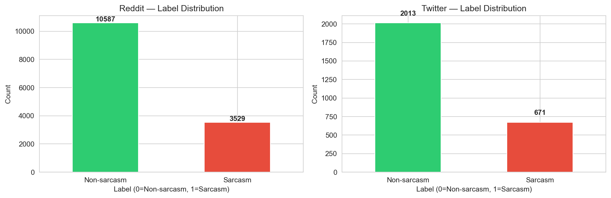
**Gambar 1.** Distribusi label sarkastik dan non-sarkastik pada dataset Reddit dan Twitter.

Selama tahap eksplorasi data awal (Exploratory Data Analysis / EDA), dilakukan pemeriksaan kualitas data yang mencakup pengecekan nilai kosong, duplikasi, dan distribusi panjang teks. Hasilnya menunjukkan bahwa tidak ada nilai kosong pada kedua dataset. Untuk dataset Reddit, ditemukan 10 data duplikat, sedangkan dataset Twitter tidak memiliki duplikat sama sekali. Distribusi panjang teks menunjukkan bahwa rata-rata komentar sarkastik di Reddit cenderung lebih pendek dibandingkan non-sarkastik (67 vs 104 karakter), sementara di Twitter perbedaannya tidak signifikan (118 vs 114 karakter).

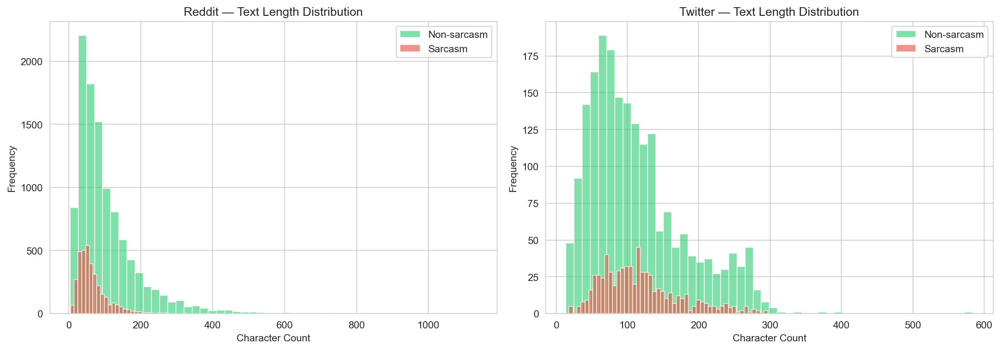
**Gambar 2.** Distribusi panjang teks (jumlah karakter) per kelas pada dataset Reddit dan Twitter.

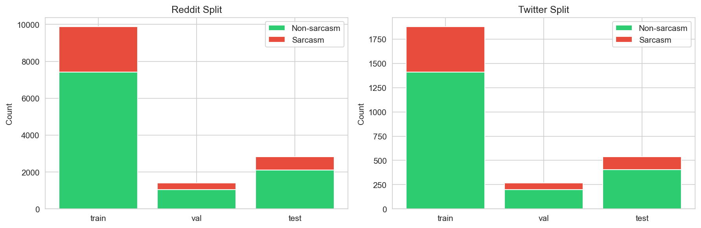
**Gambar 3.** Distribusi jumlah data per subset (train, validasi, test) pada kedua dataset.

Perbedaan ukuran kedua dataset ini cukup mencolok. Dataset Reddit memiliki volume data sekitar lima kali lipat lebih besar dibandingkan Twitter. Ini perlu diperhatikan karena jumlah data yang lebih besar tidak otomatis menghasilkan performa lebih tinggi jika karakteristik teksnya berbeda. Berdasarkan temuan EDA, teks Reddit memiliki variasi panjang yang lebih lebar, sedangkan teks Twitter lebih seragam.

### 2.2 Algoritma atau Metode

Bagian ini diperbarui secara bertahap mengikuti progress proyek. Setelah Progress 2 menutup baseline classical ML, Progress 3 menambahkan baseline fine-tuned transformer yang menjadi inti dari judul proyek, lalu Progress 4 menambahkan baseline zero-shot LLM untuk melihat kemampuan model besar tanpa fine-tuning.

#### 2.2.1 Baseline Classical Machine Learning (Progress 2)

Untuk Progress 2, tiga algoritma classical machine learning direproduksi sesuai dengan yang digunakan dalam paper IdSarcasm [5], yaitu Logistic Regression, Naive Bayes (Multinomial), dan Support Vector Machine (SVM). Ketiga algoritma ini merupakan baseline standar dalam tugas klasifikasi teks yang telah banyak digunakan dalam penelitian NLP sebelumnya, di antaranya untuk klasifikasi sentimen dan deteksi sarkasme [2][9][13]. Implementasinya menggunakan scikit-learn, yaitu library Python yang umum dipakai untuk eksperimen machine learning klasik [11].

**Logistic Regression (LR)** adalah model klasifikasi linier yang bekerja dengan mempelajari bobot (weight) untuk setiap fitur kata, merepresentasikan seberapa kuat kata tersebut mengindikasikan kelas sarkastik atau non-sarkastik. Hyperparameter utama yang digunakan adalah **C**, yaitu parameter yang mengontrol seberapa ketat model mengikuti data latih. C kecil (misalnya 0,01) berarti regularisasi kuat, model lebih sederhana dan tidak overfit. Sebaliknya, C besar (misalnya 100) membuat model lebih fleksibel tapi berisiko overfitting. Rentang C pada paper adalah [0,01, 0,1, 1, 10, 100] [5].

**Naive Bayes (Multinomial NB)** adalah algoritma klasifikasi probabilistik yang sederhana tapi sering jadi baseline yang kompetitif dalam klasifikasi teks [9]. Hyperparameter utamanya adalah **alpha** (α), yaitu parameter smoothing Laplace yang mengatur bagaimana model menangani kata-kata yang tidak muncul saat training. Alpha terlalu kecil membuat model tergantung pada frekuensi kata yang terlihat, alpha terlalu besar membuat distribusi terlalu seragam. Pada paper, alpha dicari dalam rentang 0,001 sampai 1 menggunakan `linspace` [5].

**Support Vector Machine (SVM)** atau Support Vector Classification (SVC) adalah algoritma yang mencari boundary terbaik antara dua kelas dalam ruang fitur [10]. SVM efektif untuk klasifikasi teks karena mampu menangani dimensi fitur yang tinggi. Hyperparameter yang digunakan meliputi **C** (parameter regularisasi, sama seperti LR) dan **kernel** yang menentukan bentuk boundary. Dua kernel dievaluasi: **linear** (pemisahan garis lurus) dan **rbf** (Radial Basis Function, yang bisa menangkap pola non-linear) [5].

Untuk representasi fitur, digunakan **Bag of Words (BoW)** dan **TF-IDF** (Term Frequency-Inverse Document Frequency). BoW merepresentasikan setiap dokumen sebagai vektor frekuensi kemunculan kata dalam vocabulary. TF-IDF memberikan bobot lebih tinggi pada kata yang sering muncul di satu dokumen tapi jarang di dokumen lain, sehingga kata umum seperti "dan" atau "yang" mendapat bobot rendah [8]. Tokenisasi menggunakan `nltk.word_tokenize` untuk memecah kalimat menjadi token kata.

#### 2.2.2 Model Transformer (Progress 3)

Pada Progress 3, eksperimen diperluas dari model classical ML ke model transformer. Transformer adalah arsitektur deep learning berbasis attention, yaitu mekanisme yang membuat model bisa memberi bobot berbeda pada kata-kata di dalam kalimat sesuai konteksnya [15]. Dalam tugas deteksi sarkasme, hal ini penting karena makna sarkastik sering tidak muncul dari satu kata saja, tetapi dari hubungan antar kata, gaya kalimat, dan konteks implisit.

Model transformer yang digunakan pada Progress 3 mengikuti baseline fine-tuned pre-trained language models dari paper IdSarcasm [5]. Istilah pre-trained berarti model sudah dilatih terlebih dahulu pada korpus teks besar, lalu diadaptasi lagi untuk tugas spesifik melalui fine-tuning. Fine-tuning di proyek ini berarti melatih ulang model pada dataset IdSarcasm dengan label biner: 0 untuk non-sarkastik dan 1 untuk sarkastik. Head bawaan model untuk tugas asal digantikan dengan classification head untuk klasifikasi biner, yaitu layer linear yang menghasilkan prediksi dua kelas.

Enam model baseline transformer yang dijalankan adalah IndoBERT Base (IndoNLU), IndoBERT Large (IndoNLU), IndoBERT Base (IndoLEM), mBERT, XLM-R Base, dan XLM-R Large. IndoBERT dan mBERT masih berada dalam keluarga BERT, yaitu model encoder yang umum dipakai untuk tugas klasifikasi teks [16]. XLM-R merupakan model multilingual berbasis RoBERTa yang dilatih untuk banyak bahasa dan sering kuat pada tugas lintas bahasa [17]. IndoLEM dipakai karena memang disiapkan untuk beberapa tugas NLP bahasa Indonesia [18].

Berbeda dengan classical ML yang memakai BoW atau TF-IDF, transformer tidak memakai fitur frekuensi kata secara langsung. Teks terlebih dahulu diubah menjadi token subword oleh tokenizer, lalu token tersebut masuk ke encoder transformer. Dengan cara ini, model dapat memanfaatkan representasi kata yang lebih kontekstual. Misalnya kata yang sama bisa punya bobot berbeda tergantung kalimatnya. Ini lebih cocok untuk sarkasme dibanding hanya menghitung frekuensi kata, walaupun tetap tidak menjamin model selalu memahami maksud sarkastik dengan benar.

#### 2.2.3 Zero-shot Large Language Model (Progress 4)

Pada Progress 4, eksperimen dilanjutkan ke zero-shot large language model (LLM). Zero-shot berarti model tidak dilatih ulang menggunakan dataset IdSarcasm. Model hanya diberi prompt, lalu diminta menentukan apakah teks termasuk sarkastik atau non-sarkastik. Tahap ini penting karena paper IdSarcasm juga membandingkan model fine-tuned dengan model LLM zero-shot [5]. Dengan begitu, proyek tidak hanya melihat model yang dilatih khusus pada dataset, tetapi juga melihat apakah model besar bisa langsung memahami sarkasme bahasa Indonesia tanpa adaptasi.

Model yang digunakan mengikuti daftar zero-shot pada paper, yaitu keluarga BLOOMZ dan mT0: BLOOMZ-560M, BLOOMZ-1.1B, BLOOMZ-1.7B, BLOOMZ-3B, BLOOMZ-7.1B, mT0 Small, mT0 Base, mT0 Large, dan mT0 XL. Runner Progress 4 memakai lima prompt dari source code asli paper. Untuk jalur HuggingFace, model tidak dibiarkan menjawab bebas, tetapi dihitung log probability untuk dua kandidat label: `sarcastic` dan `not sarcastic`. Label dengan skor lebih tinggi dipilih sebagai prediksi. Cara ini dipakai agar evaluasi lebih stabil dan lebih dekat dengan metode paper dibanding parsing jawaban bebas.

Berbeda dari transformer Progress 3, zero-shot tidak membutuhkan training epoch, optimizer, atau early stopping. Beban utamanya justru ada pada inference. Setiap data test dievaluasi dengan lima prompt, sehingga Twitter membutuhkan 538 × 5 scoring per model, sedangkan Reddit membutuhkan 2.824 × 5 scoring per model. Karena itu, Reddit jauh lebih berat dan beberapa run Reddit tidak selesai di Colab karena sesi komputasi berakhir sebelum evaluasi selesai.


#### 2.2.4 Optimasi Transformer dan Eksperimen Model Ringan Modern (Progress 5)

Pada Progress 5, fokus utama proyek masuk ke optimasi performa, bukan hanya penambahan model baru. Optimasi yang dipilih adalah *threshold tuning* pada XLM-R Large. Secara sederhana, model transformer menghasilkan skor probabilitas untuk kelas sarkastik. Pada evaluasi standar, prediksi biasanya memakai ambang 0,5. Jika probabilitas sarkastik di atas 0,5, teks dianggap sarkastik. Namun, dari Progress 3 terlihat bahwa XLM-R Large pada Twitter memiliki recall tinggi tetapi precision lebih rendah. Artinya, model cukup agresif memprediksi sarkastik. Karena itu, ambang keputusan perlu dicoba ulang menggunakan data validasi.

Selain *threshold tuning*, dilakukan juga eksperimen kecil hyperparameter pada XLM-R Base. Tujuannya bukan membuat grid besar, tetapi melihat apakah perubahan learning rate, panjang maksimum input, weight decay, dan label smoothing memberi arah perbaikan yang masuk akal. XLM-R Base dipakai sebagai tahap screening karena lebih ringan dibanding XLM-R Large. Konfigurasi yang terlihat baik dapat menjadi kandidat untuk dicoba pada XLM-R Large jika waktu komputasi masih tersedia.

Sebagai eksperimen tambahan, proyek juga mencoba dua model LLM ringan modern melalui LM Studio, yaitu Qwen3.5-4B dan Gemma 4 E4B dalam format GGUF. Keduanya diuji pada dataset Twitter dalam mode zero-shot dan few-shot. Eksperimen ini tidak dianggap sebagai optimasi utama transformer, tetapi sebagai pembanding praktis: apakah model modern yang bisa berjalan lokal dapat mengungguli zero-shot BLOOMZ/mT0 dari Progress 4 atau mendekati model fine-tuned.

### 2.3 Analisis Kebutuhan Proyek

Untuk menjalankan eksperimen baseline classical ML, dibutuhkan Python 3.10+ dengan pustaka scikit-learn, pandas, nltk, dan dataset dari HuggingFace yang di-cache lokal. Untuk perangkat keras, eksperimen classical ML tidak butuh GPU dan bisa dijalankan di komputer lokal standar (i5-12400F, 16GB RAM) dalam waktu beberapa menit.

Untuk eksperimen transformer pada Progress 3, kebutuhan komputasinya jauh lebih besar. Library utama yang dipakai adalah PyTorch, HuggingFace Transformers, Datasets, Evaluate, Accelerate, dan scikit-learn. Training dijalankan melalui Google Colab GPU karena fine-tuning enam model pada dua dataset membutuhkan akselerasi GPU. Model besar seperti XLM-R Large memiliki parameter jauh lebih banyak dibanding model classical ML, sehingga tidak realistis jika dijalankan cepat di CPU lokal.

Kebutuhan penyimpanan juga bertambah. Hasil metrik disimpan di `results/tables/transformer_baselines.csv`, ringkasan setiap run disimpan di `results/transformer/*/metrics.json` dan `result_row.json`, sedangkan log Colab disimpan di `results/logs/`. Folder checkpoint model tidak dimasukkan ke Git karena ukurannya besar. Yang dimasukkan ke repo hanya hasil, log, script, notebook, dan figure agar laporan tetap bisa diverifikasi.

Untuk Progress 4 zero-shot, kebutuhan GPU tetap ada, tetapi karakter bebannya berbeda. Tidak ada proses training, namun inference dilakukan berulang untuk setiap kombinasi model, dataset, dan prompt. Twitter relatif ringan karena test set hanya 538 data, sedangkan Reddit jauh lebih berat karena test set berisi 2.824 data. Pada praktiknya, seluruh 9 model Twitter berhasil dijalankan di Colab, tetapi Reddit baru selesai untuk 5 dari 9 model. Empat run Reddit lainnya sudah dicoba dan memiliki log, tetapi tidak selesai karena sesi Colab berakhir sebelum evaluasi selesai. Kondisi ini tidak dihapus, melainkan dicatat sebagai keterbatasan sumber daya komputasi pada reproduksi.

Untuk Progress 5, kebutuhan komputasi terbagi menjadi dua jalur. Jalur optimasi transformer tetap dijalankan di Colab GPU karena membutuhkan fine-tuning dan prediksi ulang model XLM-R. Hasil yang disimpan tidak hanya metrik akhir, tetapi juga `predictions.csv`, `threshold_sweep.csv`, dan `metrics.json` agar proses pemilihan threshold dapat diperiksa kembali. Jalur modern LLM dijalankan di Windows 11 melalui LM Studio karena model GGUF lebih praktis dijalankan secara lokal. Pada jalur ini, tantangan utamanya bukan training, tetapi konsistensi format output model. Untuk Qwen3.5-4B, perlu menonaktifkan mode berpikir dengan instruksi khusus agar model langsung mengeluarkan label akhir.

---

## 3. Pemodelan/Sistem/Aplikasi

### 3.1 Ilustrasi atau Arsitektur Projek

Alur kerja (pipeline) eksperimen classical ML pada proyek ini terdiri dari beberapa tahap utama yang saling berurutan. Pertama, data mentah dimuat dari file CSV yang telah di-cache secara lokal. Kemudian, teks diproses melalui tahap tokenisasi menggunakan `nltk.word_tokenize` untuk memecah kalimat menjadi kata-kata individual. Setelah itu, teks yang sudah ditokenisasi direpresentasikan sebagai vektor numerik menggunakan Bag of Words (CountVectorizer) atau TF-IDF (TfidfVectorizer). Vektor fitur ini kemudian digunakan untuk melatih model klasifikasi (LR, NB, atau SVM) dengan pencarian hyperparameter melalui GridSearchCV. Terakhir, model terbaik dievaluasi pada subset test menggunakan metrik accuracy, precision, recall, dan F1-score.

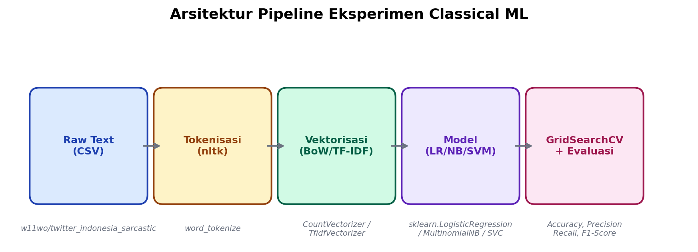
**Gambar 4.** Arsitektur pipeline eksperimen classical ML dari pemuatan data hingga evaluasi model.

Setelah Progress 3, pipeline proyek bertambah dengan jalur fine-tuning transformer. Jalur ini tetap dimulai dari dataset IdSarcasm, tetapi setelah data dimuat, teks diproses oleh tokenizer milik masing-masing model. Token tersebut kemudian masuk ke encoder transformer, dilanjutkan ke classifier head, lalu model dievaluasi dengan metrik yang sama: accuracy, precision, recall, dan F1-score.

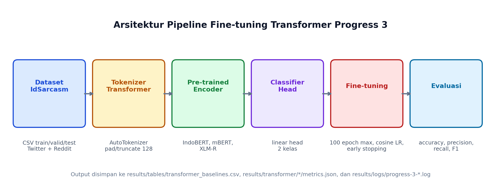
**Gambar 5.** Arsitektur pipeline eksperimen transformer pada Progress 3 dari dataset sampai evaluasi.

Pada Progress 4, arsitektur eksperimen berubah menjadi zero-shot inference. Dataset langsung masuk ke rangkaian prompt tanpa proses training. Setiap teks diuji dengan lima prompt, kemudian model BLOOMZ atau mT0 memberi skor untuk dua label kandidat. Hasil akhirnya adalah rata-rata metrik dari lima prompt tersebut.

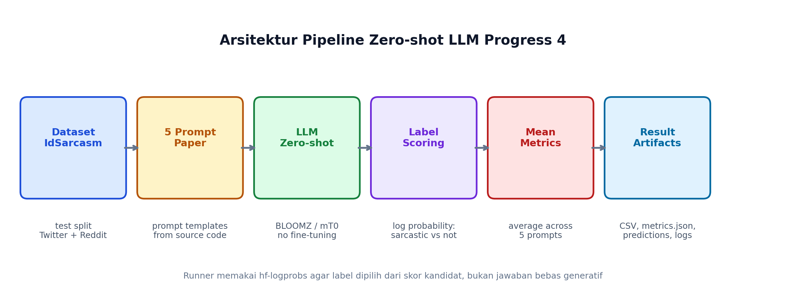
**Gambar 6.** Arsitektur pipeline zero-shot LLM pada Progress 4 dari dataset, prompt, scoring label, sampai penyimpanan hasil.

### 3.2 Tahapan

#### 3.2.1 Tahapan Eksperimen Classical ML (Progress 2)

Eksperimen dilaksanakan dalam beberapa tahap sebagai berikut:

1. Dataset dimuat dari HuggingFace dan disimpan dalam format CSV lokal, termasuk pembagian data menjadi subset train, validasi, dan test sesuai split dari paper.
2. Dilakukan tahap EDA untuk memahami karakteristik dataset, termasuk distribusi kelas, panjang teks, dan kualitas data.
3. Teks diproses melalui tokenisasi dan vektorisasi menggunakan BoW (CountVectorizer) atau TF-IDF (TfidfVectorizer).
4. Ketiga model (LR, NB, SVM) dilatih menggunakan GridSearchCV dengan PredefinedSplit untuk menemukan kombinasi hyperparameter terbaik pada masing-masing dataset dan metode vektorisasi. Train dan validasi digabung, lalu PredefinedSplit digunakan agar validasi tetap jadi holdout selama pencarian, konsisten dengan pendekatan paper.
5. Model dengan hyperparameter terbaik dievaluasi pada subset test untuk menghitung accuracy, precision, recall, dan F1-score.

Untuk memastikan reproduktibilitas, seluruh proses eksperimen dijalankan melalui skrip Python (`scripts/run_classical_baselines.py`) yang dapat dijalankan ulang secara konsisten. Hasil evaluasi disimpan dalam format CSV di direktori `results/tables/` untuk kemudian dianalisis dan dibandingkan dengan hasil yang dilaporkan paper.

#### 3.2.2 Tahapan Eksperimen Transformer (Progress 3)

Eksperimen transformer Progress 3 dijalankan sebagai paper baseline complete untuk fine-tuned transformer. Awalnya scope hanya diarahkan ke satu atau dua model pada dataset Twitter. Setelah runner dan notebook Colab stabil, scope diperluas menjadi 12 run, yaitu 6 model pada 2 dataset: Twitter dan Reddit. Dengan begitu, hasil Progress 3 tidak hanya menunjukkan satu baseline kecil, tetapi sudah bisa dibandingkan langsung dengan tabel transformer pada paper IdSarcasm [5].

Tahapan eksperimen dilakukan sebagai berikut:

1. Source code asli paper pada folder `source-code/original-id-sarcasm/` dibaca kembali, terutama recipe baseline di `recipes/twitter/baseline/` dan `recipes/reddit/baseline/`. Tujuannya agar konfigurasi training tidak asal berbeda dari paper.
2. Runner `scripts/run_transformer_baseline.py` disiapkan untuk menjalankan fine-tuning HuggingFace Transformers dengan output yang lebih rapi untuk repo ini. Runner tersebut tetap mengikuti konfigurasi utama paper, tetapi tidak melakukan `push_to_hub` karena project UAS hanya membutuhkan hasil lokal.
3. Notebook `notebooks/02_transformer_baseline_colab.ipynb` dipakai sebagai tempat eksekusi Colab. Notebook ini berisi smoke test, eksekusi penuh, dan bagian ringkasan hasil.
4. Setiap teks diproses menggunakan tokenizer model masing-masing dengan `max_length=128` dan padding ke panjang maksimum.
5. Training dilakukan dengan learning rate 1e-5, batch size train 32, batch size evaluasi 64, scheduler cosine, weight decay 0,03, maksimum 100 epoch, seed 42, dan early stopping. Early stopping berarti training dihentikan lebih awal jika metrik validasi tidak membaik lagi, sehingga model tidak terus dilatih sampai overfit.
6. Evaluasi akhir dilakukan pada test set untuk memperoleh accuracy, precision, recall, dan F1-score. Nilai F1 tetap dipakai sebagai metrik utama karena kelas sarkastik hanya 25% dari data.
7. Semua hasil eksekusi penuh dipastikan memiliki `sample_limited=false`, sehingga tidak tercampur dengan smoke test. Smoke test disimpan terpisah di `results/tables/transformer_smoke.csv`.

Konfigurasi ini dibuat sedekat mungkin dengan acuan konfigurasi paper. Perbedaan yang sengaja dipertahankan hanya pada sisi operasional, seperti tidak mengunggah model ke HuggingFace Hub dan tidak menyimpan checkpoint besar ke repo. Ringkasan konfigurasi utama ditunjukkan pada Tabel 1.

**Tabel 1.** Ringkasan Konfigurasi Fine-tuning Transformer Progress 3

| Komponen | Konfigurasi Progress 3 | Catatan |
|----------|------------------------|---------|
| Dataset | Twitter dan Reddit IdSarcasm | Menggunakan split train, validasi, dan test dari benchmark |
| Model | 6 baseline transformer paper | IndoBERT, mBERT, XLM-R, termasuk varian base/large |
| Max length | 128 token | Sama dengan recipe baseline paper |
| Batch size | Train 32, eval 64 | Mengikuti acuan konfigurasi paper dan dijalankan di Colab GPU |
| Learning rate | 1e-5 | Dipadukan dengan scheduler cosine |
| Weight decay | 0,03 | Digunakan untuk mengurangi overfitting |
| Epoch maksimum | 100 | Training dapat berhenti lebih awal karena early stopping |
| Early stopping | Patience 3, threshold 0,01 | Berhenti jika metrik validasi tidak membaik setelah beberapa evaluasi |
| Metric utama | F1-score | Dipilih karena kelas sarkastik hanya 25% dari data |
| Padding | Pad to max length | Membuat panjang input konsisten untuk batching |
| FP16 | Aktif saat CUDA tersedia | Membantu efisiensi memori dan waktu training di GPU |

#### 3.2.3 Tahapan Zero-shot LLM (Progress 4)

Eksperimen zero-shot Progress 4 dijalankan untuk mengikuti bagian zero-shot LLM pada paper. Target idealnya adalah 18 eksekusi penuh, yaitu 9 model pada 2 dataset. Pada praktiknya, 14 eksekusi selesai dan 4 run Reddit tercatat sebagai percobaan yang tidak selesai karena keterbatasan durasi sesi Colab.

Tahapan eksperimen dilakukan sebagai berikut:

1. Runner `scripts/run_zeroshot_baseline.py` disiapkan dengan dua mode: HuggingFace log probability (`hf-logprobs`) dan OpenAI-compatible API untuk LM Studio. Hasil laporan ini memakai mode `hf-logprobs` karena paling dekat dengan paper.
2. Lima prompt dari source code asli paper dipakai tanpa diubah. Setiap contoh test diproses dengan lima prompt, bukan hanya satu prompt. Pada prompt berikut, bagian `{text}` diganti dengan teks tweet atau komentar Reddit yang sedang dievaluasi:

   - Prompt 1: `{text} => Sarcasm:`
   - Prompt 2: `Text: {text} => Sarcasm:`
   - Prompt 3:
     ```text
     {text}
     Is this text above sarcastic or not?
     ```
   - Prompt 4:
     ```text
     Is the following text sarcastic?
     Text: {text}
     Answer:
     ```
   - Prompt 5:
     ```text
     Text: {text}
     Please classify the text above for sarcasm.
     ```

   Contoh sederhananya, jika teks yang diuji adalah `Bagus sekali, internet mati pas deadline`, maka salah satu prompt yang masuk ke model menjadi `Bagus sekali, internet mati pas deadline => Sarcasm:`. Setelah itu, model tidak dinilai dari jawaban bebas, tetapi dari skor label kandidat.
3. Untuk setiap prompt, runner menghitung skor dua label kandidat, yaitu `sarcastic` dan `not sarcastic`. Prediksi akhir per prompt diambil dari label dengan log probability paling besar.
4. Metrik dihitung per prompt, lalu dirata-ratakan menjadi metrik akhir setiap model. File yang disimpan meliputi `metrics.json`, `result_row.json`, `predictions.csv`, log, dan ringkasan CSV `results/tables/zeroshot_baselines.csv`.
5. Eksekusi Twitter diselesaikan untuk semua 9 model. Eksekusi Reddit berhasil selesai untuk BLOOMZ-560M, BLOOMZ-1.1B, BLOOMZ-1.7B, BLOOMZ-3B, dan mT0 Small. BLOOMZ-7.1B, mT0 Base, mT0 Large, dan mT0 XL sudah dicoba, tetapi belum selesai karena sesi Colab berakhir sebelum evaluasi selesai.

**Tabel 2.** Ringkasan Konfigurasi Zero-shot LLM Progress 4

| Komponen | Konfigurasi Progress 4 | Catatan |
|----------|------------------------|---------|
| Dataset | Twitter dan Reddit IdSarcasm | Menggunakan split test untuk evaluasi |
| Model | 9 model zero-shot paper | BLOOMZ dan mT0 berbagai ukuran |
| Prompt | 5 prompt | Diambil dari source code asli paper |
| Backend | HuggingFace `hf-logprobs` | Menghitung skor label, bukan jawaban bebas |
| Label kandidat | `sarcastic`, `not sarcastic` | Prediksi dipilih dari skor tertinggi |
| Metric utama | F1-score | Tetap dipakai karena kelas sarkastik 25% |
| Status eksekusi | Twitter 9/9 selesai, Reddit 5/9 selesai | 4 run Reddit dicatat sebagai keterbatasan durasi sesi |

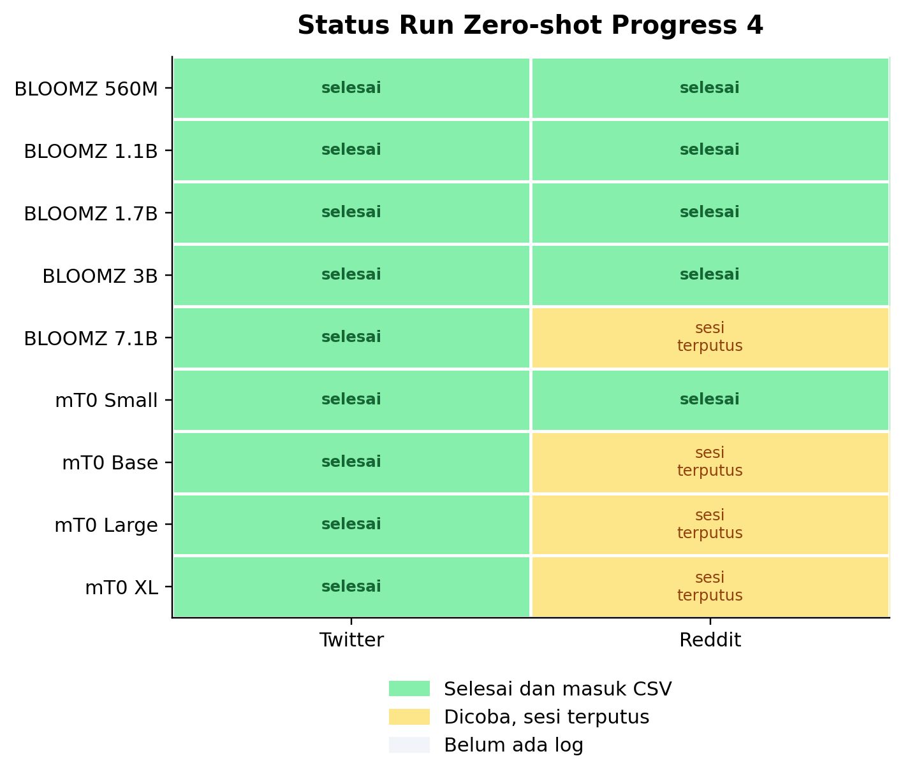
**Gambar 7.** Status penyelesaian run zero-shot LLM pada dataset Twitter dan Reddit.


#### 3.2.4 Tahapan Optimasi dan Eksperimen Modern LLM (Progress 5)

Progress 5 dilaksanakan dalam dua jalur. Jalur pertama adalah optimasi transformer, sedangkan jalur kedua adalah eksperimen LLM lokal modern. Tahapan optimasi transformer dilakukan sebagai berikut:

1. XLM-R Large dijalankan ulang pada dataset Twitter dan Reddit menggunakan konfigurasi baseline dari Progress 3.
2. Runner `scripts/run_transformer_optimization.py` menyimpan probabilitas kelas sarkastik untuk subset validasi dan test.
3. Threshold terbaik dipilih dari validation set berdasarkan F1-score. Dengan cara ini, test set tidak dipakai untuk memilih threshold, sehingga evaluasi akhir tetap lebih adil.
4. Threshold terpilih diterapkan satu kali ke test set. Hasil default dan hasil tuned kemudian dibandingkan.
5. Untuk screening hyperparameter, XLM-R Base dijalankan pada beberapa konfigurasi kecil: learning rate 5e-6 dan 2e-5, max length 256, weight decay 0,01, dan label smoothing 0,05.
6. File `predictions.csv` digunakan untuk melihat contoh yang membaik, memburuk, atau tetap salah setelah threshold tuning.

Untuk jalur LLM lokal modern, tahapan yang dilakukan adalah:

1. Model GGUF dimuat melalui LM Studio di Windows 11.
2. Script `scripts/run_modern_llm_experiments.py` memanggil endpoint OpenAI-compatible `http://localhost:1234/v1`.
3. Dua mode diuji, yaitu zero-shot dan few-shot. Pada few-shot, prompt diberi dua contoh per kelas dari data latih.
4. Untuk Qwen3.5-4B, mode berpikir perlu dinonaktifkan. Jika tidak, model menghabiskan token untuk reasoning dan tidak mengeluarkan label akhir.
5. Output model diparse menjadi dua label: `sarcastic` dan `not sarcastic`. Script juga menerima variasi bahasa Indonesia seperti `sarkastis`, `tidak sarkastis`, dan `bukan sarkastis`.
6. Hasil lengkap disimpan pada `results/tables/modern_llm_experiments.csv` dan folder `results/modern_llm/`.

**Tabel 3.** Ringkasan Konfigurasi Optimasi Progress 5

| Komponen | Konfigurasi | Catatan |
|----------|-------------|---------|
| Model utama optimasi | XLM-R Large | Model transformer terbaik dari Progress 3 |
| Metode optimasi | Threshold tuning | Threshold dipilih dari validation set, lalu diterapkan ke test set |
| Screening ringan | XLM-R Base | Digunakan untuk melihat arah hyperparameter dengan biaya lebih rendah |
| Hyperparameter yang dicoba | Learning rate, max length, weight decay, label smoothing | Grid kecil agar realistis untuk Colab |
| Modern LLM tambahan | Qwen3.5-4B dan Gemma 4 E4B GGUF | Dijalankan lokal via LM Studio, bukan fine-tuning |
| Dataset modern LLM | Twitter test set | Dipilih karena ukurannya lebih ringan untuk eksperimen lokal |

### 3.3 Hasil dan Evaluasi

#### 3.3.1 Hasil Baseline Classical ML (Progress 2)

Untuk mengevaluasi performa model, digunakan empat metrik klasifikasi standar: accuracy, precision, recall, dan F1-score [12][14]. **Accuracy** mengukur proporsi prediksi yang benar dari seluruh data test. **Precision** mengukur dari semua yang diprediksi sarkastik, berapa persen yang benar-benar sarkastik. **Recall** mengukur dari semua data sarkastik, berapa persen yang berhasil dideteksi model. **F1-score** adalah rata-rata harmonik precision dan recall, menjadikannya metrik utama dalam paper IdSarcasm karena menyeimbangkan keduanya pada dataset yang tidak seimbang [5][12].

Berikut adalah hasil eksperimen baseline classical ML pada dataset Twitter:

**Tabel 4.** Hasil Eksperimen pada Dataset Twitter

| Vektorisasi | Model | Best Params | Accuracy | Precision | Recall | F1-Score |
|-------------|-------|-------------|----------|-----------|--------|----------|
| BoW | Logistic Regression | C=100 | 0,8587 | 0,7101 | 0,7313 | 0,7206 |
| BoW | Naive Bayes | α=0,450 | 0,8532 | 0,7570 | 0,6045 | 0,6722 |
| BoW | SVM | C=100, kernel=rbf | 0,8513 | 0,7250 | 0,6493 | 0,6850 |
| TF-IDF | Logistic Regression | C=10 | 0,8662 | 0,7627 | 0,6716 | 0,7143 |
| TF-IDF | Naive Bayes | α=0,103 | 0,8197 | 0,7761 | 0,3881 | 0,5174 |
| TF-IDF | SVM | C=10, kernel=rbf | 0,8625 | 0,8125 | 0,5821 | 0,6783 |

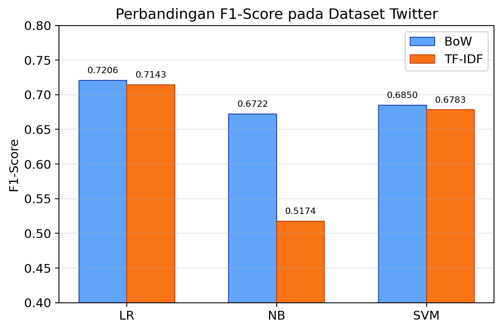
**Gambar 8.** Perbandingan F1-score antar model pada dataset Twitter untuk metode vektorisasi BoW dan TF-IDF.

Berikut adalah hasil eksperimen pada dataset Reddit:

**Tabel 5.** Hasil Eksperimen pada Dataset Reddit

| Vektorisasi | Model | Best Params | Accuracy | Precision | Recall | F1-Score |
|-------------|-------|-------------|----------|-----------|--------|----------|
| BoW | Logistic Regression | C=1 | 0,7840 | 0,6000 | 0,4079 | 0,4857 |
| BoW | Naive Bayes | α=0,531 | 0,7890 | 0,6389 | 0,3584 | 0,4592 |
| BoW | SVM | C=0,1, kernel=linear | 0,7851 | 0,6592 | 0,2904 | 0,4031 |
| TF-IDF | Logistic Regression | C=10 | 0,7847 | 0,5980 | 0,4235 | 0,4959 |
| TF-IDF | Naive Bayes | α=0,062 | 0,7776 | 0,6500 | 0,2394 | 0,3499 |
| TF-IDF | SVM | C=1, kernel=linear | 0,7886 | 0,6461 | 0,3414 | 0,4467 |

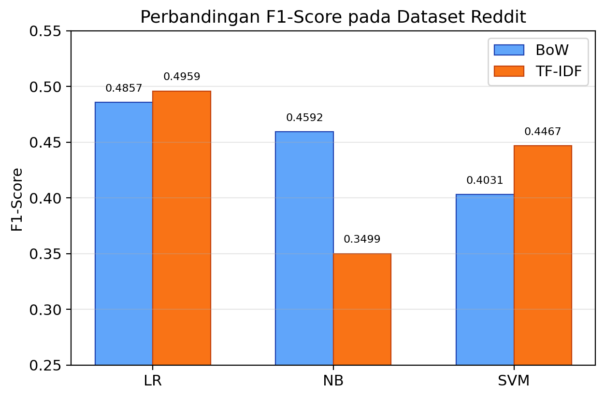
**Gambar 9.** Perbandingan F1-score antar model pada dataset Reddit untuk metode vektorisasi BoW dan TF-IDF.

Untuk memvalidasi reproduktibilitas, hasil eksperimen dibandingkan dengan target F1-score yang dilaporkan dalam paper IdSarcasm [5]:

**Tabel 6.** Perbandingan Hasil Reproduksi vs Paper (TF-IDF)

| Model | Twitter Paper | Twitter Reproduksi | Selisih | Reddit Paper | Reddit Reproduksi | Selisih |
|-------|--------------|-------------------|---------|-------------|-------------------|---------|
| Logistic Regression | 0,7142 | 0,7143 | +0,0001 | 0,4887 | 0,4959 | +0,0072 |
| Naive Bayes | 0,6721 | 0,5174 | -0,1547 | 0,4591 | 0,3499 | -0,1092 |
| SVM | 0,6782 | 0,6783 | +0,0001 | 0,4467 | 0,4467 | 0,0000 |

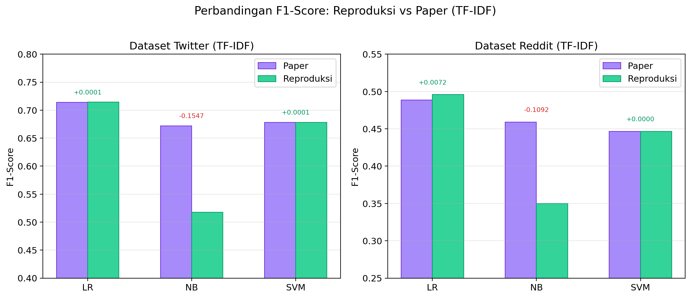
**Gambar 10.** Perbandingan F1-score hasil reproduksi dengan target paper pada dataset Twitter dan Reddit menggunakan TF-IDF.

Dari tabel perbandingan di atas, terlihat bahwa reproduksi untuk Logistic Regression dan SVM pada dataset Twitter menghasilkan F1-score yang sangat mendekati bahkan identik dengan yang dilaporkan paper. Hal ini menunjukkan bahwa implementasi eksperimen berhasil mereproduksi hasil paper dengan baik untuk kedua model tersebut. Untuk Logistic Regression pada dataset Reddit, hasil reproduksi sedikit di atas target paper (+0,0072), yang kemungkinan disebabkan oleh perbedaan versi pustaka atau seed random yang berbeda saat GridSearchCV.

Namun, untuk Naive Bayes terdapat gap yang cukup besar, terutama pada dataset Twitter (-0,1547) dan Reddit (-0,1092). Salah satu dugaan penyebabnya adalah perbedaan versi atau karakteristik dataset. Paper IdSarcasm [5] menggunakan dataset Twitter versi asli yang berisi 12.861 data tidak seimbang, sedangkan versi benchmark yang dirilis di HuggingFace dan digunakan di reproduksi ini hanya 2.684 data dengan rasio kelas 25:75. Naive Bayes juga lebih bergantung pada distribusi frekuensi kata, sehingga perubahan ukuran dan distribusi data dapat memengaruhi hasilnya. Meskipun demikian, pola umum hasil tetap konsisten dengan paper: Logistic Regression dan SVM cenderung lebih baik dari Naive Bayes, dan TF-IDF umumnya lebih stabil dibandingkan BoW.

#### 3.3.2 Hasil Model Transformer (Progress 3)

Progress 3 menghasilkan 12 baseline fine-tuned transformer: enam model pada dataset Reddit dan enam model pada dataset Twitter. Keenam model tersebut adalah IndoBERT Base (IndoNLU), IndoBERT Large (IndoNLU), IndoBERT Base (IndoLEM), mBERT, XLM-R Base, dan XLM-R Large. Hasil utama dapat dilihat pada Tabel 7.

**Tabel 7.** Hasil Reproduksi Baseline Transformer Progress 3

| Model | Reddit Paper | Reddit Reproduksi | Selisih | Twitter Paper | Twitter Reproduksi | Selisih |
|-------|-------------:|------------------:|--------:|--------------:|-------------------:|--------:|
| IndoBERT Base (IndoNLU) | 0,6100 | 0,5839 | -0,0261 | 0,7273 | 0,6812 | -0,0461 |
| IndoBERT Large (IndoNLU) | 0,6184 | 0,5825 | -0,0359 | 0,7160 | 0,6831 | -0,0329 |
| IndoBERT Base (IndoLEM) | 0,5671 | 0,5457 | -0,0214 | 0,6462 | 0,6835 | +0,0373 |
| mBERT | 0,5338 | 0,5413 | +0,0075 | 0,6467 | 0,7092 | +0,0625 |
| XLM-R Base | 0,5690 | 0,5819 | +0,0129 | 0,7386 | 0,7000 | -0,0386 |
| XLM-R Large | 0,6274 | 0,6117 | -0,0157 | 0,7692 | 0,7226 | -0,0466 |

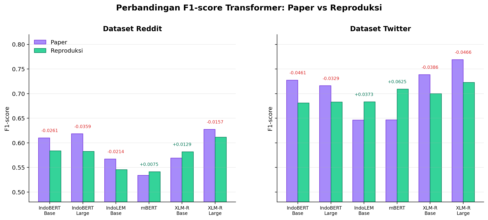
**Gambar 11.** Perbandingan F1-score baseline transformer antara paper dan hasil reproduksi Progress 3.

Berdasarkan hasil tersebut, model terbaik pada kedua dataset adalah XLM-R Large. Pada Reddit, XLM-R Large memperoleh F1-score 0,6117, sedangkan target paper adalah 0,6274. Selisihnya -0,0157, jadi masih cukup dekat. Pada Twitter, XLM-R Large memperoleh F1-score 0,7226, lebih rendah dari paper 0,7692 dengan selisih -0,0466. Walaupun belum menyamai paper, urutan model terbaik tetap masuk akal karena XLM-R Large juga menjadi model terbaik pada paper IdSarcasm [5].

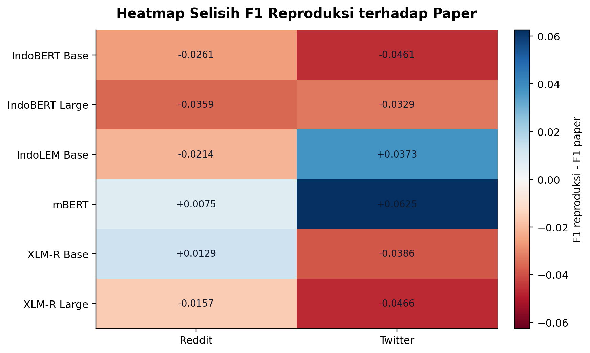
**Gambar 12.** Heatmap selisih F1-score hasil reproduksi terhadap paper untuk setiap model dan dataset.

Ada beberapa pola yang menarik. Pada Reddit, gap reproduksi cenderung kecil. IndoBERT Base, IndoBERT Large, dan IndoLEM Base memang masih di bawah paper, tetapi XLM-R Base dan mBERT justru sedikit di atas paper. Hasil ini mengindikasikan bahwa pipeline reproduksi yang digunakan sudah menghasilkan performa yang relatif dekat dengan paper pada beberapa model. Pada Twitter, hasilnya lebih campuran. mBERT dan IndoLEM Base berada di atas paper, tetapi IndoBERT Base, IndoBERT Large, XLM-R Base, dan XLM-R Large masih di bawah paper.

Perbedaan ini kemungkinan dipengaruhi oleh beberapa hal. Pertama, training transformer lebih sensitif terhadap versi library, GPU, seed, dan detail implementasi kecil dibanding classical ML. Kedua, beberapa checkpoint IndoBERT/IndoLEM menampilkan warning kompatibilitas `LayerNorm.gamma/beta` terhadap format Transformers versi baru. Training tetap selesai, tetapi warning ini menunjukkan bahwa checkpoint lama dan library baru tidak sepenuhnya identik. Ketiga, data Twitter yang tersedia di HuggingFace adalah versi benchmark 2.684 data dengan rasio 1:3, sehingga perubahan kecil pada hasil prediksi dapat memengaruhi F1-score.

Jika dibandingkan dengan baseline classical ML terbaik, peningkatan transformer paling terlihat pada Reddit. Baseline classical terbaik Reddit adalah TF-IDF Logistic Regression dengan F1-score 0,4959, sedangkan XLM-R Large mencapai 0,6117. Kenaikannya +0,1158. Untuk Twitter, baseline classical terbaik adalah BoW Logistic Regression dengan F1-score 0,7206, sedangkan XLM-R Large mencapai 0,7226. Kenaikannya hanya +0,0020. Jadi, pada Twitter, model classical yang sederhana masih mampu bersaing dengan transformer terbaik pada reproduksi ini.

**Tabel 8.** Perbandingan Model Terbaik Classical ML dan Transformer

| Dataset | Best Classical ML | F1 Classical | Best Transformer | F1 Transformer | Selisih |
|---------|-------------------|-------------:|------------------|---------------:|--------:|
| Reddit | TF-IDF Logistic Regression | 0,4959 | XLM-R Large | 0,6117 | +0,1158 |
| Twitter | BoW Logistic Regression | 0,7206 | XLM-R Large | 0,7226 | +0,0020 |

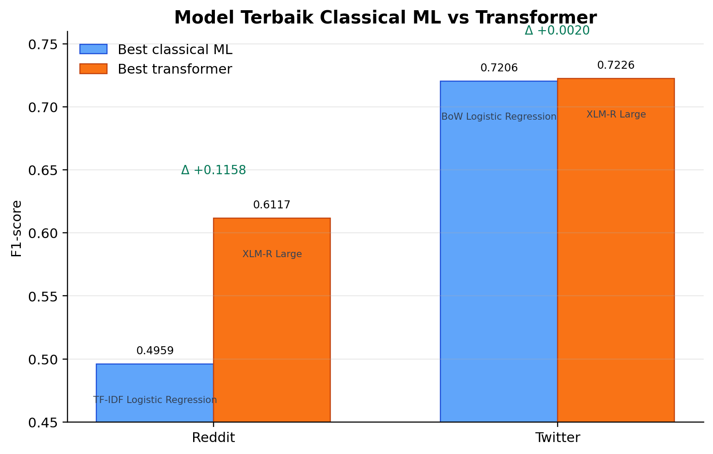
**Gambar 13.** Perbandingan model terbaik classical ML dan model terbaik transformer pada masing-masing dataset.

Hasil ini penting untuk interpretasi proyek. Transformer memang unggul, tetapi tidak selalu dengan margin besar. Temuan ini mengindikasikan bahwa transformer berpotensi lebih membantu pada teks Reddit yang relatif lebih panjang dan lebih kontekstual, meskipun dugaan ini masih perlu dikonfirmasi melalui analisis error yang lebih rinci. Model berbasis representasi kontekstual seperti XLM-R dapat menangkap pola yang tidak mudah ditangkap oleh TF-IDF. Pada Twitter, teks lebih pendek dan beberapa pola sarkasme kemungkinan dapat tertangkap oleh kata atau frasa tertentu, sehingga Logistic Regression dengan BoW mendekati performa XLM-R Large.

Untuk melihat karakter model terbaik, metrik XLM-R Large ditampilkan pada Gambar 14. Pada Twitter, recall XLM-R Large mencapai 0,8358, lebih tinggi dari precision 0,6364. Artinya, model cukup agresif menangkap kelas sarkastik, tetapi sebagian prediksi sarkastik masih salah. Pada Reddit, precision dan recall XLM-R Large lebih seimbang, yaitu 0,6188 dan 0,6048. Ini menunjukkan performa Reddit lebih merata, meskipun F1 keseluruhannya masih lebih rendah daripada Twitter.

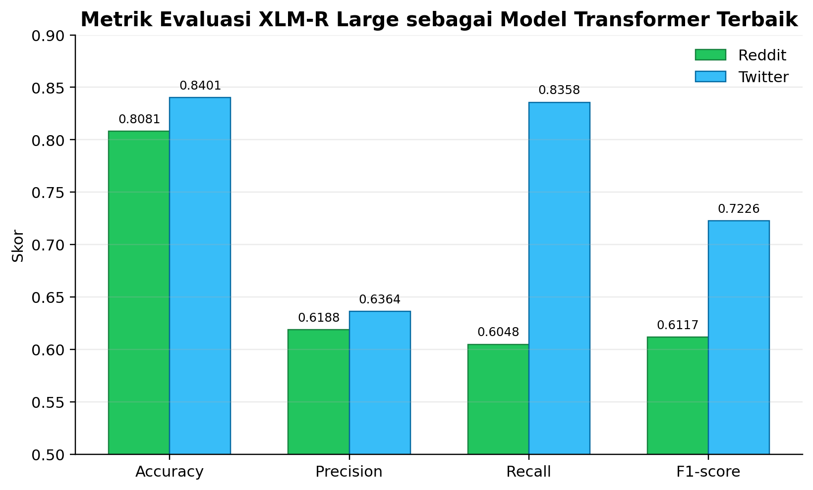
**Gambar 14.** Accuracy, precision, recall, dan F1-score XLM-R Large pada dataset Reddit dan Twitter.

Keterbatasan Progress 3 tetap perlu dicatat. Pertama, setiap model dijalankan dengan satu seed utama, yaitu seed 42, sehingga laporan ini belum mengukur variasi hasil antar seed. Kedua, analisis error belum dilakukan, jadi penjelasan tentang kenapa model tertentu lebih unggul masih berupa interpretasi awal dari metrik, bukan kesimpulan final. Ketiga, beberapa checkpoint lama menampilkan warning kompatibilitas saat dijalankan dengan versi Transformers yang lebih baru. Keempat, checkpoint model tidak disimpan di repo karena ukurannya besar, sehingga verifikasi difokuskan pada script, notebook, log, dan file metrik.

Secara teknis, Progress 3 sudah selesai karena semua model paper untuk kategori fine-tuned transformer berhasil dijalankan, hasilnya tersimpan, dan gap terhadap paper dapat dianalisis. Secara metodologis, eksperimen ini sudah mengacu pada acuan konfigurasi paper, dengan keterbatasan seperti yang dijelaskan di atas. Fokus berikutnya bukan lagi menambah baseline transformer, tetapi masuk ke Progress 4, yaitu baseline zero-shot LLM atau eksperimen lanjutan yang berbeda dari fine-tuning transformer.

#### 3.3.3 Hasil Zero-shot LLM (Progress 4)

Progress 4 menghasilkan eksekusi penuh zero-shot untuk seluruh 9 model pada dataset Twitter. Untuk dataset Reddit, 5 dari 9 model selesai, sedangkan 4 model lain sudah dicoba tetapi tidak selesai karena sesi Colab berakhir sebelum evaluasi selesai. Empat run Reddit yang belum selesai adalah BLOOMZ-7.1B, mT0 Base, mT0 Large, dan mT0 XL. Karena setiap model Reddit membutuhkan 14.120 proses scoring (2.824 data test × 5 prompt), kegagalan ini lebih tepat dicatat sebagai keterbatasan sumber daya komputasi, bukan sebagai hasil metrik. Dengan demikian, `results/tables/zeroshot_baselines.csv` hanya memuat 14 eksekusi penuh yang selesai, sedangkan 4 run Reddit yang terputus hanya didukung oleh log parsial.

Empat run Reddit yang terputus tidak dimasukkan ke tabel hasil akhir dan tidak dipakai dalam perbandingan kuantitatif, walaupun beberapa log masih menyimpan jejak proses atau metrik parsial. Misalnya, log mT0 Base sempat mencatat metrik untuk sebagian prompt, tetapi belum menghasilkan metrik rata-rata akhir yang sah untuk dibandingkan.

**Tabel 9.** Hasil Zero-shot LLM Progress 4 Dibandingkan dengan Paper

| Model | Twitter Paper | Twitter Reproduksi | Selisih | Reddit Paper | Reddit Reproduksi / Status | Selisih |
|-------|--------------:|-------------------:|--------:|-------------:|----------------------------:|--------:|
| BLOOMZ-560M | 0,3916 | 0,3899 | -0,0017 | 0,3870 | 0,3857 | -0,0013 |
| BLOOMZ-1.1B | 0,3987 | 0,3988 | +0,0001 | 0,3944 | 0,3938 | -0,0006 |
| BLOOMZ-1.7B | 0,3885 | 0,3893 | +0,0008 | 0,3758 | 0,3763 | +0,0005 |
| BLOOMZ-3B | 0,3847 | 0,3858 | +0,0011 | 0,4000 | 0,3995 | -0,0005 |
| BLOOMZ-7.1B | 0,3968 | 0,3965 | -0,0003 | 0,4036 | sesi terputus | - |
| mT0 Small | 0,3988 | 0,3988 | 0,0000 | 0,4000 | 0,4000 | 0,0000 |
| mT0 Base | 0,3985 | 0,3986 | +0,0001 | 0,3990 | sesi terputus | - |
| mT0 Large | 0,3989 | 0,3989 | 0,0000 | 0,3998 | sesi terputus | - |
| mT0 XL | 0,3988 | 0,3988 | 0,0000 | 0,4001 | sesi terputus | - |

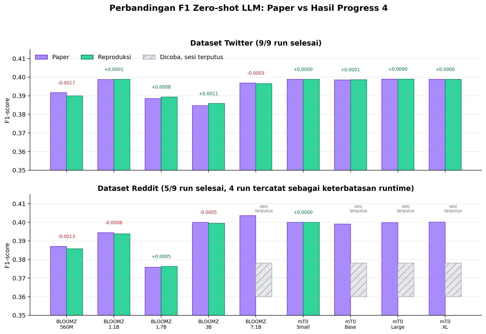
**Gambar 15.** Perbandingan F1-score zero-shot LLM antara paper dan hasil Progress 4.

Dari hasil tersebut, bagian Twitter sangat mendekati hasil paper. Semua selisih F1 berada di sekitar -0,0017 sampai +0,0011. Artinya, implementasi zero-shot yang dipakai kemungkinan sudah cukup dekat dengan metode paper untuk dataset Twitter. Pada Reddit, lima model yang selesai juga sangat dekat dengan paper. BLOOMZ-560M, BLOOMZ-1.1B, BLOOMZ-1.7B, BLOOMZ-3B, dan mT0 Small semuanya memiliki selisih yang sangat kecil. Empat model Reddit yang belum selesai tidak diisi dengan angka perkiraan karena tidak ada evaluasi final yang valid.

Namun, hasil zero-shot ini perlu dibaca hati-hati. F1 sekitar 0,39-0,40 bukan berarti model benar-benar memahami sarkasme dengan baik. Pada banyak run, recall sangat tinggi tetapi precision rendah. Contohnya, mT0 Small pada Twitter dan Reddit memiliki recall 1,0000, tetapi precision hanya sekitar 0,249-0,250. Pola ini berarti model sering memilih label sarkastik. Karena kelas sarkastik hanya 25% dari data, strategi yang terlalu sering memprediksi sarkastik dapat menghasilkan recall tinggi dan F1 sekitar 0,40, tetapi accuracy tetap rendah.

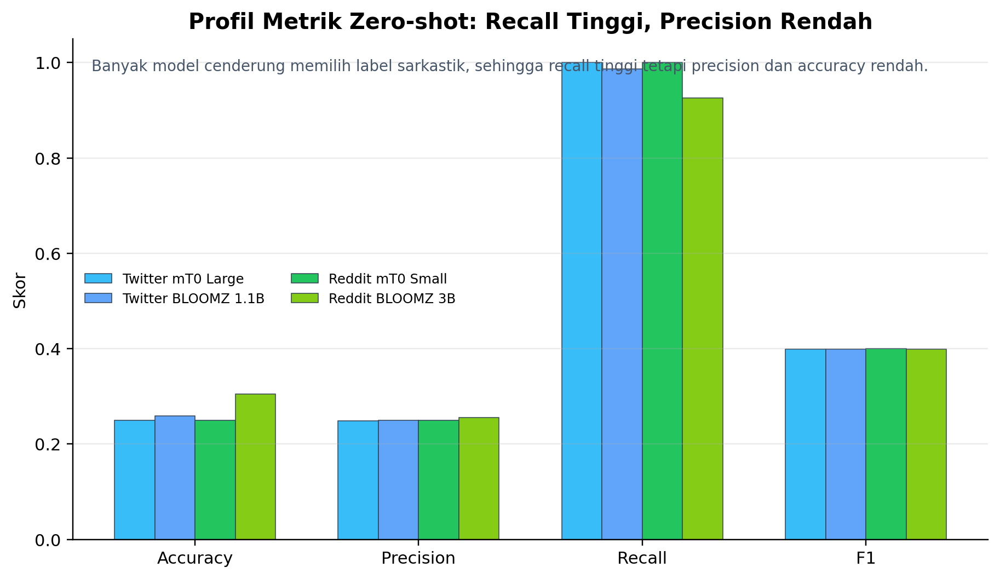
**Gambar 16.** Profil accuracy, precision, recall, dan F1 pada beberapa model zero-shot yang mewakili hasil Progress 4.

Dari sisi waktu eksekusi, Twitter jauh lebih ringan dibanding Reddit. Eksekusi Twitter tercepat selesai sekitar 3 menit, sedangkan BLOOMZ-7.1B Twitter membutuhkan sekitar 27,9 menit. Untuk Reddit, eksekusi yang selesai membutuhkan sekitar 14-21 menit per model. Pada kondisi Colab yang digunakan, run Reddit yang lebih berat lebih rentan terputus karena keterbatasan durasi sesi, proses loading model, atau offloading ke CPU.

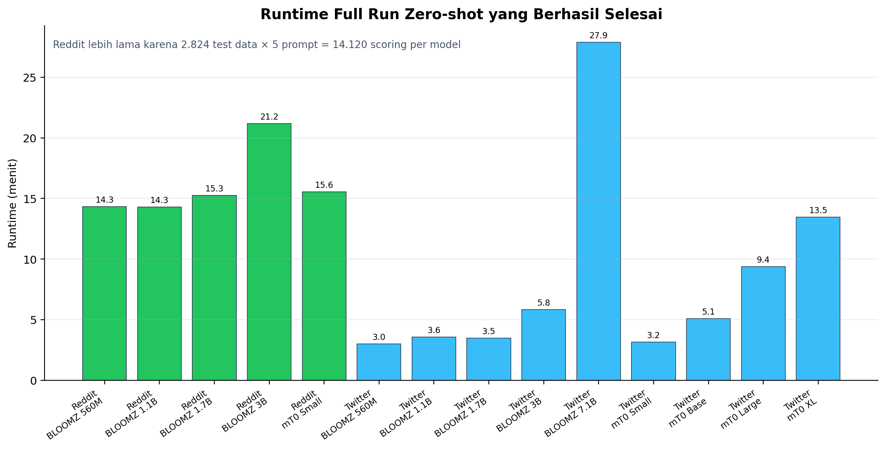
**Gambar 17.** Runtime eksekusi penuh zero-shot yang berhasil selesai pada Progress 4.

Kesimpulan Progress 4 sementara adalah hasil zero-shot LLM sangat mendekati paper untuk semua run Twitter dan lima run Reddit yang selesai. Akan tetapi, performanya masih jauh di bawah fine-tuned transformer. Pada reproduksi ini, model besar tanpa fine-tuning belum cukup kuat untuk deteksi sarkasme bahasa Indonesia, sejalan dengan temuan paper IdSarcasm [5].

#### 3.3.4 Analisis Komparatif Sementara sampai Progress 4

Jika dibandingkan antar-kelompok metode, transformer masih menjadi pendekatan terbaik pada proyek ini. Classical ML cukup kuat pada Twitter, tetapi tertinggal di Reddit. Zero-shot LLM berada paling rendah pada kedua dataset, meskipun hasilnya paling dekat dengan paper karena memang pola zero-shot paper juga rendah.

**Tabel 10.** Perbandingan Model Terbaik per Kelompok Metode sampai Progress 4

| Dataset | Best Classical ML | F1 Classical | Best Transformer | F1 Transformer | Best Zero-shot yang Selesai | F1 Zero-shot |
|---------|-------------------|-------------:|------------------|---------------:|------------------------|-------------:|
| Reddit | TF-IDF Logistic Regression | 0,4959 | XLM-R Large | 0,6117 | mT0 Small | 0,4000 |
| Twitter | BoW Logistic Regression | 0,7206 | XLM-R Large | 0,7226 | mT0 Large | 0,3989 |

Pada Reddit, transformer memberi kenaikan yang jelas dibanding classical ML dan zero-shot. XLM-R Large mencapai F1 0,6117, sedangkan classical terbaik hanya 0,4959 dan zero-shot terbaik dari eksekusi yang selesai hanya 0,4000. Ini menunjukkan bahwa fine-tuning memang membantu model belajar pola sarkasme dari dataset target. Pada Twitter, classical ML dan transformer hampir imbang, yaitu 0,7206 vs 0,7226. Sementara itu, zero-shot tetap tertinggal jauh di sekitar 0,3989.

Interpretasi utamanya adalah model besar tidak otomatis lebih baik jika tidak diadaptasi ke tugas. Untuk deteksi sarkasme bahasa Indonesia, data berlabel dan fine-tuning masih jauh lebih penting daripada ukuran model saja. Progress berikutnya sebaiknya tidak memaksa zero-shot untuk mengalahkan transformer, tetapi memakai hasil ini sebagai pembanding: model tanpa fine-tuning cepat disiapkan, tetapi akurasinya lemah dan cenderung bias ke label sarkastik.


#### 3.3.5 Hasil Optimasi dan Eksperimen Modern LLM (Progress 5)

Progress 5 menunjukkan bahwa optimasi sederhana melalui threshold tuning berhasil memperbaiki model transformer utama. Pada dataset Twitter, XLM-R Large meningkat dari F1 0,7226 menjadi 0,7649. Kenaikan sebesar +0,0423 ini penting karena hasil tuned sudah mendekati target paper Twitter untuk XLM-R Large, yaitu 0,7692 [5]. Threshold terbaik yang dipilih dari validation set adalah 0,85. Angka ini lebih tinggi dari threshold standar 0,5, sehingga model menjadi lebih selektif saat memberi label sarkastik. Dampaknya terlihat pada precision yang naik dari 0,6364 menjadi 0,7219, sementara recall masih relatif tinggi, yaitu 0,8134.

Pada dataset Reddit, XLM-R Large juga meningkat, tetapi lebih kecil. F1 naik dari 0,6117 menjadi 0,6241, dengan threshold terbaik 0,26. Kenaikannya +0,0124. Hasil ini tetap bernilai karena F1 paper untuk Reddit XLM-R Large adalah 0,6274, sehingga hasil tuned sudah mendekati target paper. Pada Reddit, threshold 0,26 menurunkan precision dari 0,6188 menjadi 0,5596, tetapi recall naik dari 0,6048 menjadi 0,7054. Jadi kenaikan F1 terjadi karena tambahan recall lebih besar daripada penurunan precision. Perbedaan arah threshold antara Twitter dan Reddit menunjukkan bahwa karakter kedua dataset memang berbeda.

Setelah hasil Progress 5 selesai, dilakukan satu run optimasi lanjutan yang lebih terarah pada XLM-R Large. Konfigurasi learning rate dinaikkan dari 1e-5 menjadi 2e-5 pada dataset Twitter dengan max length 128. Hasilnya, F1 default naik menjadi 0,7905. Nilai ini melampaui target paper Twitter 0,7692 dengan selisih +0,0213. Pada run yang sama, threshold tuning validation memilih threshold 0,94 dan menghasilkan F1 test 0,7762. Karena F1 default lebih tinggi, hasil final Twitter memakai konfigurasi XLM-R Large learning rate 2e-5 dengan threshold standar.

**Tabel 11.** Hasil Threshold Tuning XLM-R Large

| Dataset | Threshold | F1 Default | F1 Tuned | Delta F1 | Precision Tuned | Recall Tuned |
|---------|----------:|-----------:|---------:|---------:|----------------:|-------------:|
| Twitter | 0,85 | 0,7226 | 0,7649 | +0,0423 | 0,7219 | 0,8134 |
| Reddit | 0,26 | 0,6117 | 0,6241 | +0,0124 | 0,5596 | 0,7054 |

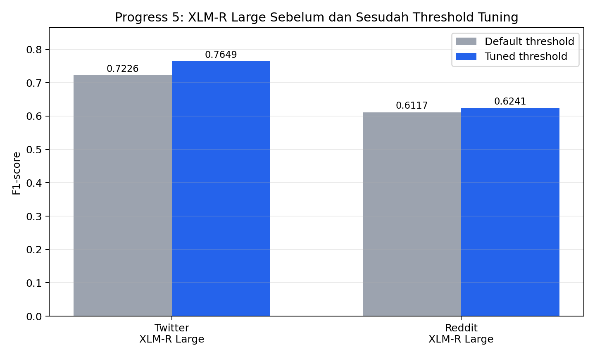
**Gambar 18.** Perbandingan F1-score XLM-R Large sebelum dan sesudah threshold tuning pada dataset Twitter dan Reddit.

**Tabel 12.** Optimasi Lanjutan XLM-R Large pada Twitter

| Konfigurasi | F1 Default | F1 Tuned | Target Paper | Status |
|-------------|-----------:|---------:|-------------:|--------|
| lr=2e-5, len=128 | 0,7905 | 0,7762 | 0,7692 | melampaui paper |

Hasil screening XLM-R Base pada Twitter memperlihatkan bahwa tidak semua perubahan hyperparameter memberi dampak positif. Konfigurasi learning rate 2e-5 dengan max length 128 menghasilkan F1 tuned terbaik di antara varian XLM-R Base, yaitu 0,7317. Konfigurasi label smoothing 0,05 justru turun setelah threshold tuning, dari F1 default 0,7260 menjadi 0,6877. Sementara itu, learning rate 5e-6 menghasilkan F1 default 0,0000 tetapi setelah threshold tuning naik menjadi 0,4800. Kasus ini menunjukkan bahwa threshold tuning bisa memperbaiki output model yang probabilitasnya tidak terkalibrasi dengan baik, tetapi bukan berarti model tersebut menjadi kandidat terbaik.

**Tabel 13.** Ringkasan Screening XLM-R Base pada Twitter

| Konfigurasi | F1 Default | F1 Tuned | Delta F1 | Threshold |
|-------------|-----------:|---------:|---------:|----------:|
| lr=5e-6, len=128 | 0,0000 | 0,4800 | +0,4800 | 0,25 |
| lr=2e-5, len=128 | 0,7039 | 0,7317 | +0,0278 | 0,17 |
| lr=1e-5, len=256 | 0,6953 | 0,6953 | 0,0000 | 0,50 |
| lr=1e-5, wd=0,01 | 0,7154 | 0,7115 | -0,0039 | 0,41 |
| label smoothing=0,05 | 0,7260 | 0,6877 | -0,0383 | 0,67 |

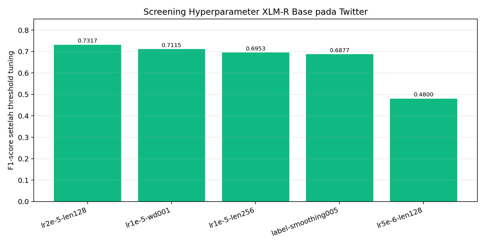
**Gambar 19.** Hasil screening hyperparameter XLM-R Base berdasarkan F1-score setelah threshold tuning.

Analisis transisi error memperjelas dampak threshold tuning. Pada Twitter, terdapat 22 contoh test yang sebelumnya salah dan menjadi benar setelah threshold tuning, sedangkan hanya 3 contoh yang sebelumnya benar menjadi salah. Ini menjelaskan kenapa F1 Twitter naik cukup besar. Pada Reddit, terdapat 71 contoh yang membaik, tetapi 129 contoh justru memburuk. Walaupun demikian, pergeseran precision dan recall secara keseluruhan tetap memberi kenaikan F1 kecil pada Reddit. Dengan kata lain, threshold tuning lebih efektif pada Twitter daripada Reddit.

**Tabel 14.** Transisi Prediksi Setelah Threshold Tuning XLM-R Large

| Dataset | Membaik | Memburuk | Tetap Benar | Tetap Salah |
|---------|--------:|---------:|------------:|------------:|
| Twitter | 22 | 3 | 449 | 64 |
| Reddit | 71 | 129 | 2153 | 471 |

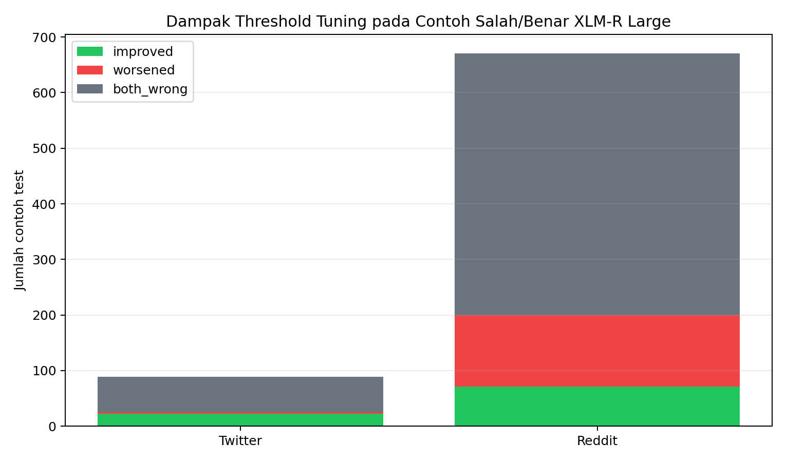
**Gambar 20.** Jumlah contoh test yang membaik, memburuk, atau tetap salah setelah threshold tuning.

Untuk eksperimen LLM lokal modern, empat run penuh Twitter berhasil diselesaikan: Qwen3.5-4B zero-shot, Qwen3.5-4B few-shot, Gemma 4 E4B zero-shot, dan Gemma 4 E4B few-shot. Seluruh run memiliki `invalid_outputs=0`, sehingga hasilnya valid untuk dibandingkan. Qwen3.5-4B few-shot menjadi yang terbaik di kelompok modern LLM lokal dengan F1 0,4755. Qwen3.5-4B zero-shot sedikit lebih rendah, yaitu 0,4665. Gemma 4 E4B memperoleh F1 0,4400 pada zero-shot dan 0,4580 pada few-shot.

**Tabel 15.** Hasil Modern Local LLM pada Dataset Twitter

| Model | Mode | Accuracy | Precision | Recall | F1 | Invalid Output |
|-------|------|---------:|----------:|-------:|---:|---------------:|
| Qwen3.5-4B | Zero-shot | 0,6896 | 0,4078 | 0,5448 | 0,4665 | 0 |
| Qwen3.5-4B | Few-shot | 0,7416 | 0,4809 | 0,4701 | 0,4755 | 0 |
| Gemma 4 E4B | Zero-shot | 0,3755 | 0,2833 | 0,9851 | 0,4400 | 0 |
| Gemma 4 E4B | Few-shot | 0,4721 | 0,3077 | 0,8955 | 0,4580 | 0 |

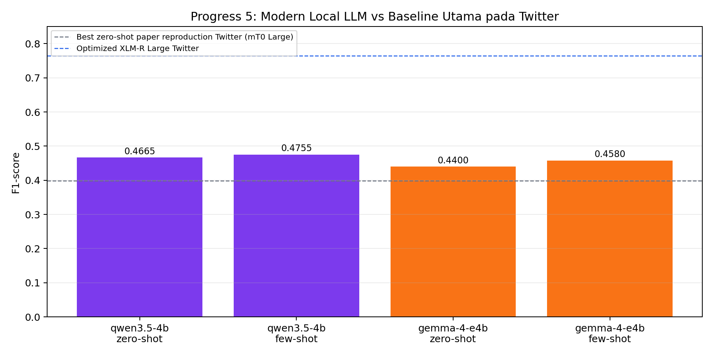
**Gambar 21.** Perbandingan F1-score LLM lokal modern dengan baseline zero-shot terbaik dan XLM-R Large hasil optimasi.

Dari hasil ini, modern LLM lokal memang lebih baik daripada zero-shot BLOOMZ/mT0 Progress 4 pada Twitter yang berada di sekitar F1 0,3989. Namun, jaraknya masih jauh dari XLM-R Large hasil optimasi lanjutan yang mencapai F1 0,7905 pada Twitter. Hal ini memperkuat kesimpulan utama proyek bahwa, pada eksperimen ini, model yang dilatih atau dioptimasi pada dataset target masih lebih kuat daripada LLM yang hanya diberi prompt untuk deteksi sarkasme Indonesia.

Pola precision dan recall juga menarik. Gemma 4 E4B memiliki recall sangat tinggi, terutama zero-shot dengan recall 0,9851, tetapi precision rendah 0,2833. Artinya, model sangat sering memilih label sarkastik. Qwen3.5-4B lebih seimbang, terutama few-shot dengan precision 0,4809 dan recall 0,4701. Meskipun F1 Qwen belum tinggi, perilakunya lebih stabil dibanding Gemma yang terlalu agresif memprediksi sarkasme.

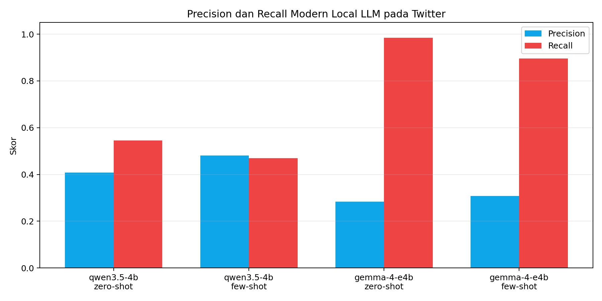
**Gambar 22.** Perbandingan precision dan recall LLM lokal modern pada dataset Twitter.

Secara keseluruhan, Progress 5 dan optimasi lanjutan memberi jawaban yang cukup kuat terhadap tujuan optimasi proyek. Threshold tuning memperbaiki XLM-R Large pada Twitter dan Reddit, lalu run lanjutan learning rate 2e-5 membuat hasil Twitter naik sampai 0,7905. Modern LLM lokal berguna sebagai pembanding praktis, namun belum mendekati performa fine-tuned transformer. Dengan demikian, arah final proyek menekankan bahwa optimasi kecil pada transformer yang sudah dilatih lebih efektif daripada hanya mengganti ke model generatif baru tanpa fine-tuning.

---

## 4. Rencana Pengembangan dan Kesimpulan Akhir

Bagian ini menjadi penutup dari seluruh rangkaian proyek. Sampai Progress 6, eksperimen sudah mencakup empat kelompok metode: classical machine learning, fine-tuned transformer, zero-shot LLM sesuai paper, dan LLM lokal modern. Setelah itu, dilakukan optimasi pada model transformer terbaik melalui threshold tuning dan satu run lanjutan XLM-R Large dengan learning rate 2e-5 pada Twitter. Jadi, fokus akhir laporan adalah menyimpulkan pola hasil yang sudah terkumpul dan menegaskan konfigurasi terbaik yang berhasil melewati paper pada Twitter.

### 4.1 Analisis Komparatif Akhir

Perbandingan akhir menunjukkan bahwa model terbaik pada kedua dataset tetap XLM-R Large, tetapi strategi optimasinya berbeda. Pada Twitter, run lanjutan dengan learning rate 2e-5 menghasilkan F1 0,7905, sehingga melampaui target paper 0,7692. Pada Reddit, hasil terbaik tetap berasal dari threshold tuning dengan F1 0,6241, masih sedikit di bawah target paper 0,6274. Hasil ini menunjukkan bahwa optimasi sederhana dapat memberi dampak nyata, tetapi efeknya tidak selalu sama pada setiap dataset.

**Tabel 16.** Perbandingan Akhir Model Terbaik per Kelompok Metode

| Dataset | Classical ML Terbaik | F1 | Transformer Baseline | F1 | Transformer Optimized | F1 | Zero-shot Terbaik | F1 | Modern Local LLM | F1 |
|---------|----------------------|---:|----------------------|---:|-----------------------|---:|------------------|---:|------------------|---:|
| Twitter | BoW Logistic Regression | 0,7206 | XLM-R Large | 0,7226 | XLM-R Large lr=2e-5 | 0,7905 | mT0 Large | 0,3989 | Qwen3.5-4B few-shot | 0,4755 |
| Reddit | TF-IDF Logistic Regression | 0,4959 | XLM-R Large | 0,6117 | XLM-R Large + threshold | 0,6241 | mT0 Small | 0,4000 | tidak dijalankan | - |

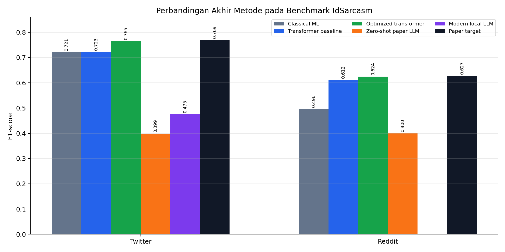
**Gambar 23.** Perbandingan F1-score akhir antar kelompok metode pada dataset Twitter dan Reddit.

Pada Twitter, classical ML ternyata sangat kompetitif. BoW Logistic Regression mencapai F1 0,7206, hanya sedikit di bawah baseline XLM-R Large 0,7226. Setelah optimasi, XLM-R Large learning rate 2e-5 naik menjadi 0,7905. Ini berarti optimasi tidak hanya memperjelas jarak dengan baseline klasik, tetapi juga membuat hasil reproduksi melampaui skor terbaik paper pada dataset Twitter.

Pada Reddit, jarak antar metode lebih terlihat sejak awal. Classical terbaik hanya mencapai F1 0,4959, sedangkan XLM-R Large baseline sudah 0,6117 dan setelah tuning menjadi 0,6241. Pola ini mengindikasikan bahwa representasi kontekstual dari transformer lebih membantu pada Reddit, yang teksnya lebih panjang dan variasinya lebih besar dibanding Twitter.

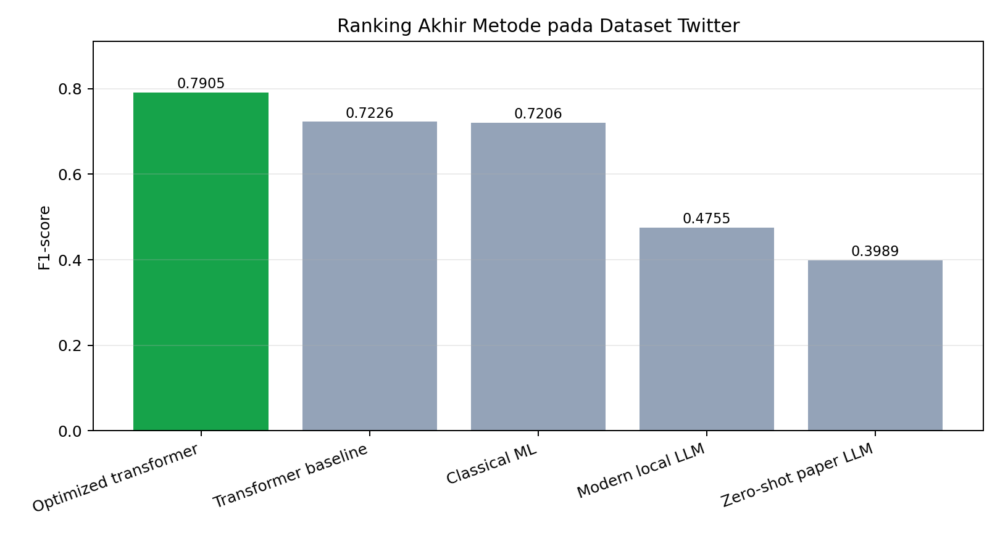
**Gambar 24.** Ranking akhir metode pada dataset Twitter berdasarkan F1-score.

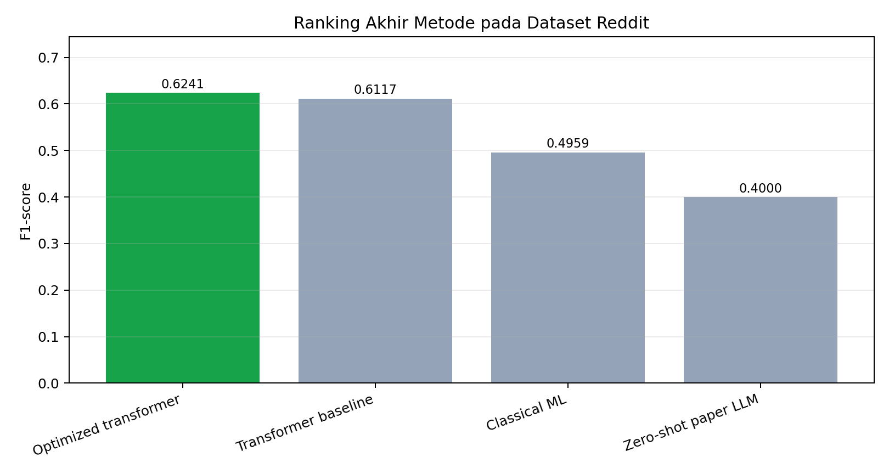
**Gambar 25.** Ranking akhir metode pada dataset Reddit berdasarkan F1-score.

Hasil zero-shot LLM dari reproduksi paper berada di kisaran F1 0,39-0,40. Hasil ini dekat dengan paper, tetapi performanya tetap jauh di bawah transformer yang dilatih pada data IdSarcasm. LLM lokal modern seperti Qwen3.5-4B dan Gemma 4 E4B memberi hasil lebih baik daripada zero-shot BLOOMZ/mT0 pada Twitter, tetapi masih belum mendekati XLM-R Large. Qwen3.5-4B few-shot menjadi LLM lokal modern terbaik dengan F1 0,4755. Jadi, model generatif modern yang ringan berguna sebagai pembanding praktis, tetapi belum cukup untuk menggantikan fine-tuning pada tugas ini.

### 4.2 Jawaban terhadap Tujuan Proyek

Tujuan proyek ini adalah mereproduksi dan mengoptimasi performa model transformer untuk klasifikasi sarkasme bahasa Indonesia berdasarkan benchmark IdSarcasm. Dalam batas eksperimen yang sudah dijalankan, tujuan utama tersebut dapat dijawab melalui tiga temuan.

Pertama, reproduksi baseline berhasil dilakukan untuk classical ML, transformer, dan zero-shot LLM. Beberapa hasil sangat dekat dengan paper, terutama classical Logistic Regression/SVM dan zero-shot LLM. Untuk transformer, hasil baseline belum selalu identik dengan paper, tetapi model terbaik yang muncul tetap konsisten, yaitu XLM-R Large.

Kedua, optimasi transformer berhasil meningkatkan performa. Pada Twitter, tuning learning rate XLM-R Large ke 2e-5 menghasilkan F1 0,7905 dan melampaui skor paper 0,7692. Pada Reddit, threshold tuning menaikkan F1 menjadi 0,6241 dan masih sangat dekat dengan paper 0,6274. Jadi, target optimasi tercapai paling kuat pada Twitter, sedangkan Reddit masih menyisakan gap kecil.

Ketiga, eksperimen LLM lokal modern menunjukkan bahwa model baru yang bisa berjalan lokal belum otomatis lebih unggul. Tanpa fine-tuning, Qwen3.5-4B dan Gemma 4 E4B masih tertinggal dari XLM-R Large. Hasil ini memperkuat bahwa data berlabel dan proses adaptasi ke task masih penting untuk deteksi sarkasme bahasa Indonesia.

### 4.3 Keterbatasan Proyek

Ada beberapa keterbatasan yang perlu dicatat. Pertama, sebagian besar eksperimen transformer memakai satu seed utama, yaitu seed 42. Karena itu, laporan ini belum mengukur variasi performa antar seed. Kedua, checkpoint model hasil fine-tuning tidak disimpan di GitHub karena ukurannya besar. Yang disimpan adalah script, log, tabel hasil, prediksi, dan figure.

Ketiga, zero-shot Reddit belum selesai untuk semua model karena keterbatasan durasi sesi Colab. Laporan ini tidak mengisi angka perkiraan untuk run yang tidak selesai. Keempat, LLM lokal modern hanya dijalankan pada Twitter karena ukuran test set lebih kecil dan lebih realistis untuk LM Studio lokal. Reddit belum dijalankan untuk Qwen/Gemma karena waktu inference akan jauh lebih lama.

Kelima, analisis error masih berbasis transisi prediksi dan contoh hasil, belum sampai anotasi linguistik yang sangat rinci. Untuk penelitian yang lebih besar, analisis dapat diperluas ke kategori sarkasme seperti sindiran politik, humor, ekspresi positif yang bermakna negatif, dan konteks percakapan yang hilang.

### 4.4 Rekomendasi Pengembangan

Jika proyek ini dilanjutkan, arah yang paling masuk akal adalah memperdalam transformer, bukan hanya menambah LLM generatif baru. Karena konfigurasi XLM-R Large learning rate 2e-5 berhasil melampaui paper pada Twitter, eksperimen lanjutan yang paling relevan adalah mencari konfigurasi serupa untuk Reddit, mencoba beberapa seed, atau memakai ensemble berbasis probabilitas validation. Selain itu, error analysis dapat dibuat lebih kualitatif dengan mengelompokkan contoh salah prediksi berdasarkan pola bahasa.

Untuk jalur modern LLM, pengembangan yang lebih kuat adalah fine-tuning ringan atau LoRA pada model yang cukup cocok untuk bahasa Indonesia, bukan hanya zero-shot/few-shot prompting. Model seperti Qwen atau Gemma mungkin lebih kompetitif jika diberi adaptasi supervised pada data IdSarcasm. Namun, itu membutuhkan GPU dan waktu eksperimen tambahan di luar scope UAS ini.

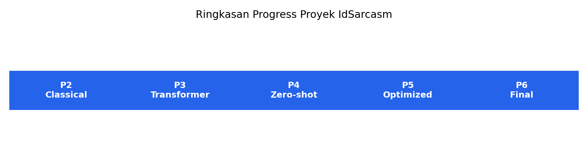
**Gambar 26.** Ringkasan alur progress proyek dari baseline sampai finalisasi.

### 4.5 Kesimpulan Akhir

Kesimpulan akhir dari proyek ini adalah XLM-R Large menjadi pendekatan terbaik untuk deteksi sarkasme bahasa Indonesia pada benchmark IdSarcasm. Setelah optimasi lanjutan, model ini mencapai F1 0,7905 pada Twitter, melampaui skor paper 0,7692. Pada Reddit, hasil terbaik mencapai F1 0,6241, masih sedikit di bawah paper 0,6274. Hasil tersebut tetap mengungguli classical ML, zero-shot LLM, serta LLM lokal modern yang diuji pada proyek ini.

Classical ML tetap penting sebagai baseline karena hasilnya kuat, khususnya pada Twitter. Namun, pada Reddit, transformer memberi keuntungan yang lebih jelas. Zero-shot LLM berhasil direproduksi dengan hasil yang dekat dengan paper, tetapi performanya rendah karena cenderung terlalu sering memilih label sarkastik. LLM lokal modern lebih baik dari zero-shot paper pada Twitter, tetapi belum cukup kuat tanpa fine-tuning.

Dengan demikian, dalam eksperimen ini, model besar saja tidak cukup untuk tugas deteksi sarkasme bahasa Indonesia. Hasil terbaik tetap diperoleh ketika model dilatih atau dioptimasi menggunakan data target. Proyek ini juga menunjukkan bahwa optimasi sederhana seperti threshold tuning dan penyesuaian learning rate bisa memberi dampak nyata; pada Twitter, dampaknya bahkan cukup untuk melewati hasil paper.

---

## 5. Referensi

[1] A. Joshi, P. Bhattacharyya, and M. J. Carman, "Automatic Sarcasm Detection: A Survey," *ACM Computing Surveys*, vol. 50, no. 5, art. no. 73, pp. 1-22, 2017, doi: 10.1145/3124420.

[2] E. Lunando and A. Purwarianti, "Indonesian Social Media Sentiment Analysis with Sarcasm Detection," in *2013 International Conference on Advanced Computer Science and Information Systems (ICACSIS)*, Bali, Indonesia, 2013, pp. 195-198, doi: 10.1109/ICACSIS.2013.6761557.

[3] K. S. Ranti and A. S. Girsang, "Indonesian Sarcasm Detection Using Convolutional Neural Network," *International Journal of Emerging Trends in Engineering Research*, vol. 8, no. 9, pp. 6448-6453, 2020, doi: 10.30534/ijeter/2020/10892020.

[4] K. Khotijah, J. Tirtawangsa, and A. B. W. Putra, "Using LSTM for Context Based Approach of Sarcasm Detection in Indonesian and English," in *2020 International Conference on Data Science and Its Applications (ICoDSA)*, Bandung, Indonesia, 2020, pp. 1-6, doi: 10.1109/ICoDSA50139.2020.9212955.

[5] D. Suhartono, W. Wongso, and A. T. Handoyo, "IdSarcasm: Benchmarking and Evaluating Language Models for Indonesian Sarcasm Detection," *IEEE Access*, vol. 12, pp. 87323-87332, 2024, doi: 10.1109/ACCESS.2024.3416955.

[6] DataReportal, "Digital 2025: Indonesia," Feb. 2025. [Online]. Available: https://datareportal.com/reports/digital-2025-indonesia. [Accessed: Apr. 16, 2026].

[7] N. H. Jeremy, "The Impact of Text Preprocessing in Sarcasm Detection on Indonesian Social Media Contents," *Engineering, Mathematics and Computer Science Journal (EMACS)*, vol. 7, no. 1, 2025, doi: 10.33021/emacs.v7i1.13503.

[8] C. D. Manning, P. Raghavan, and H. Schütze, *Introduction to Information Retrieval*. Cambridge, U.K.: Cambridge University Press, 2008, doi: 10.1017/CBO9780511809071.

[9] A. McCallum and K. Nigam, "A Comparison of Event Models for Naive Bayes Text Classification," in *AAAI-98 Workshop on Learning for Text Categorization*, Madison, WI, USA, 1998, pp. 41-48.

[10] C. Cortes and V. Vapnik, "Support-Vector Networks," *Machine Learning*, vol. 20, no. 3, pp. 273-297, 1995, doi: 10.1007/BF00994018.

[11] F. Pedregosa *et al.*, "Scikit-learn: Machine Learning in Python," *Journal of Machine Learning Research*, vol. 12, pp. 2825-2830, 2011, doi: 10.5555/1953048.2078195.

[12] M. Sokolova and G. Lapalme, "A Systematic Analysis of Performance Measures for Classification Tasks," *Information Processing & Management*, vol. 45, no. 4, pp. 427-437, 2009, doi: 10.1016/j.ipm.2009.03.002.

[13] K. Taha, P. D. Yoo, C. Y. Yeun, D. Homouz, and A. Taha, "A Comprehensive Survey of Text Classification Techniques and Their Research Applications: Observational and Experimental Insights," *Computer Science Review*, vol. 54, art. no. 100664, 2024, doi: 10.1016/j.cosrev.2024.100664.

[14] G. Naidu *et al.*, "Accuracy, Precision, Recall, F1-Score, or MCC? Empirical Evidence from Advanced Statistics, ML, and XAI for Evaluating Business Predictive Models," *Journal of Big Data*, vol. 12, art. no. 1313, 2025, doi: 10.1186/s40537-025-01313-4.

[15] A. Vaswani *et al.*, "Attention Is All You Need," in *Advances in Neural Information Processing Systems*, vol. 30, 2017.

[16] J. Devlin, M.-W. Chang, K. Lee, and K. Toutanova, "BERT: Pre-training of Deep Bidirectional Transformers for Language Understanding," in *Proceedings of NAACL-HLT*, 2019, pp. 4171-4186.

[17] A. Conneau *et al.*, "Unsupervised Cross-lingual Representation Learning at Scale," in *Proceedings of ACL*, 2020, pp. 8440-8451.

[18] F. Koto, A. Rahimi, J. H. Lau, and T. Baldwin, "IndoLEM and IndoBERT: A Benchmark Dataset and Pre-trained Language Model for Indonesian NLP," in *Proceedings of COLING*, 2020, pp. 757-770.
